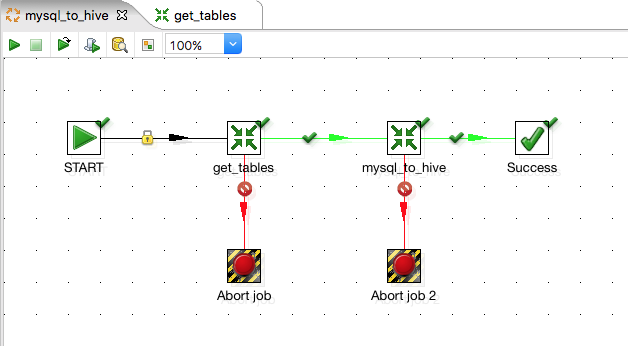
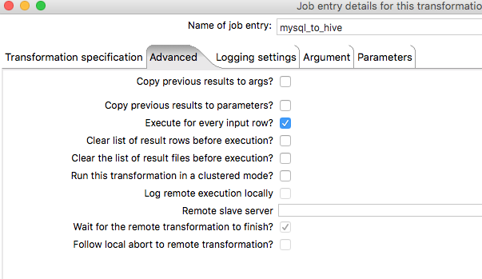
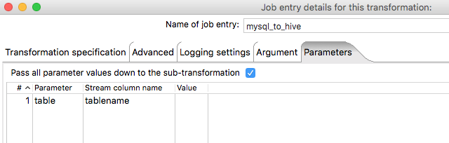

This is Part 3 of the Pentaho series where I will be covering some more advance aspects of Pentaho DI demonstrating its capabilites in migrating a set of databases from MySQL into Hive.

If you've missed [PART 1](http://gavlaaaaaaaa.github.io/Pentaho-Transformation-Overview/) or [PART 2](http://gavlaaaaaaaa.github.io/Pentaho-Jobs-Overview/) then you can always jump back!

##Migrating MySQL to Hive
With "Big Data" technologies becoming the norm for any large scale company, you may find yourself in the position where all of your existing databases and tables could do with being introduced to the new world... to kick-start your big data journey.

Hopefully by the end of this entry you will have enough understanding and inspiration to apply these techniques to **ANY** relational database in order to migrate it into Hive. 

_NOTE: although MySQL is used as an example, this approach can be applied to almost any database technology_

##Step 1 - Connecting to your MySQL instance
In order to get any data from MySQL we will need a list of tables to pull the data from, and in order to do this we need to set up a connection to the MySQL database.

We need to create a new transformation and add a _Get Table Names_ step, then double click to see how we configure it.

The second field asks for a connection, and to the right we have the choice of clicking _new_.
This brings up the database connection window where we can configure our connection. To connect to my local instance of MySQL my settings were fairly trivial.
_NOTE: You can test your connection from by clicking Test to make sure everything is correct!_

Now we can start to fill in the rest of the _Get Table Names_ step. I have a MySQL database named **test** that I am looking to migrate and I am only interested in the tables. If you wish to migrate views etc. then select those settings appropriately.

Then in the _Output fields_ section, I have filled in the _Tablename fieldname_ field with a field name for the list of tables that this step will output.

I don't want to use the table names in this transformation - so I will simply connect it to a _Copy Rows to Result_ ready to use at a later time. This completes this transformation - run it to check you get a list of table names you are expecting and save it with the name **get_tables**.

##Step 2 - Setting up the Job
We now have our intitial transformation that obtains a list of all the tables within a database for us.

Now we can set up the over arching job that will call the transformation we just made, and also another transformation that will use these table names to start migrating.

Set up a job like below - don't worry about what the second transformation is yet, we'll be building that in a moment.

The first transformation will just be pointing at the get_tables transformation we just created and doesn't require any more configuration. The second transformation is currently pointing at nothing, but we can configure it ready and go through the reasons why. Double click it and go to the _Advanced_ tab.

Here we just need to tick **Execute for every input row**. What this does is essentially tell Pentaho that for every row that is output from the previous transformation, execute this transformation that number of times, like a loop. 

Putting that into context for our example, lets say our get_tables transformation fetches 3 tables from our MySQL database. The mysql_to_hive transformation would then execute 3 times - that is all steps inside it, from start to finish are executed 3 times, one after another.

_Why would we want to do this you might be asking?!_

Flick to the Parameters tab and I'll explain why.

What we are doing here is saying that we want to pass a paremeter called _table_ into the transformation, and we are going to get its value from the **Stream** using the _Stream column name_ field. This allows us to pick up our **tablename** column we created in the previous transformation. 

This, linked with ticking _Execute for every input row_, means that for each table in that column it will execute this transformation and at the same time pass in the current table name as a parameter.

This will allow us to create the hive schemas and load the data from each table into hive one by one, until all tables are complete.

