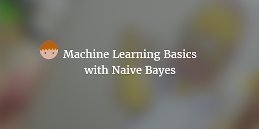

--- 
layout: post 
title:  Machine Learning Basics with Naive Bayes
author: Lewis Gavin 
comments: true 
tags: 
- data science
- machine learning
---

After researching and looking into the different algorithms associated with Machine Learning, I've found that there is an abundance of great material showing you how to use certain algorithms in a specific language. However what's usually missing is the simple mathematical explaination of how the algorithm works. In all cases this may not be possible without a strong mathematical background, but for some I know I would definitely find it useful.

This post requires just basic mathematics knowledge and an interst in data science and machine learning. I will be talking about Naive Bayes as a classifier and explaining in simple terms how it works and when you might use it.

## Machine Learning

One of the first things to understand about Machine Learning is that at it's most basic abstraction, it is a set of **algorithms** that are **data driven** in order to provide answers. This means that the data itself is just as important as the underlying algorithm. You can split Machine Learning algorithms into two categories: **Supervised** and **Unsupervised**. 

Supervised learning requires a **labelled** data set. This means each data item and all its **features** that you provide to train the algorithm are labelled with the correct answer. The algorithm then uses this combo of data item and outcome/answer in order to "learn" what sorts of things dictate a certain answer. When provided with data it has never seen before, that isn't labelled, this trained model can then **predict** the answer based on what it has seen before.

Unsupervised learning is the opposite. It does not know upfront what it is looking for so it has to figure out itself how to cluster the features to learn and reach an outcome.

## Naive Bayes

So where does Naive Bayes fit into all this? 

Naive Bayes is a **Supervised** machine learning algorithm. It is commonly used with text based data sets in order to learn and understand something about text. For example, given a set of emails and people that wrote them, Naive Bayes can be used to build a model to understand the writing styles of each email author. Once trained, it can then be given an email without being told who wrote it. It can then predict who wrote it based on what it was taught. As you can see, the training data is vital to the success of the model.

*Image taken from [Simafore.com](http://www.simafore.com/blog/bid/107271/How-to-apply-and-interpret-Naive-Bayes-classification-in-RapidMiner)*

## How does it work?

