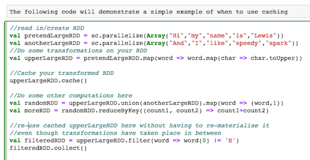

Recently I attended the Strata and Hadoop World Conf in London, you can see my post on the day [here](http://www.lewisgavin.co.uk/Strata-Hadoop/). As part of the afternoon technical sessions, I attended a talk by Holden Karau on scaling Spark applications. 

The talk gave me a lot of good tips to take away and implement into my own Spark code so I thought they were worth sharing. 

## 1. Caching and Checkpointing -  which one and when? 

RDD's can sometimes be expensive to materialise. Even when they're not, you wouldn't want to remake them over and over again. Caching RDD's, especially when expensive, allows reuse without a performance overhead. Take the example below. 

*Created using [spark notebook](http://spark-notebook.io/)*

By simply caching the RDD I can happily re-use it for some later transformations without having to rebuild it from scratch. 

RDDs can be cached in memory (by default) or persisted to disk. You would choose the persistence level based on your use case and the size of the RDD. Full details on parameters can be found [here](http://spark.apache.org/docs/latest/programming-guide.html#rdd-persistence)

If you are in a noisey cluster, checkpointing may also help to store RDD's to files within HDFS saving memory. Otherwise it is recommended to only use checkpoints when your RDD lineage gets too large. 
It is important that you persist/cache your RDD first before checkpointing as checkpointing will materialise the RDD twice, once when it builds it for use and again when it needs to write it to disk - however if you have cached it before hand, it only needs to materialise it once, the second time it can read from the cache.

**So whats the difference between checkpoints and using `persist(DISK_ONLY)` I hear you ask?**
Great question! The answer is simple - persisting will materialise and save the RDD in memory or disk or both depending on your configuration and will also **store and remember the lineage**. 
This means that if are Node failures on the node storing your cached RDD, they can be rebuilt as using the lineage. Checkpoints **do not store the lineage** and will only write RDD contents to disk.

## 2. Skewed Keys 

Holden used the term Key skewing to describe the challenge when keys aren't evenly distributed. Key skewing can lead to unbalanced partitions meaning that transformations wont be distributed well meaning they can take longer to run. Null records are something that can cause key skewing, especially if they are frequent. 

`GroupByKey()` in particular doesn't work well when keys are skewed, however it is an inefficient operation for many other reasons. 

To prevent key skewing from nulls, you can try filtering out nulls as early on as possible in your dataset. If this isnt possible then add some extra junk to your key to help the distribution. This technique will then allow for a more random nature for keys meaning they are better distributed. This is an important part of how HBase works. HBase architects always recommend concatenating multiple columns to create keys or hashing values if you cannot guarentee randomness. 

SortByKey suffers from similar issues as all data for a key goes to the same node. If your keys are skewed a high percentaged of your data could end up going to one node and filling it. Again, you can simply add some extra junk to the key to help distribute it better and prevent this from happening.

## 3. The evil Group By Key

GroupByKey groups all records with the same key into a single record - but this is what you want and expected right?

The catch is that it will do this even if we want to immediately reduce or sum on this RDD afterwards. In addition, this single record - especially for wide data sets - can be too big to fit in memory and then cause your application to fail - disaster! 

To overcome this `ReduceByKey()` allows map side reduction and therefore doesn't make a super large single record. It will also reduce the data locally before distributing it across the network again boosting its efficiency.

## 4. Spark SQL and DataFrames to the rescue

DataFrames are more efficient than RDD's in many use cases for a number of reasons. Firstly, non JVM users using Python or R should use DataFrames. This is because DataFrames allow Spark to manage the schema and only pass data between nodes. This is more efficient than Java serialization. DataFrames use serialization to their benefit when performing transformations that are large within a single process. They can essentially write data outside of the heap memory and still perform transformations on this data avoiding the garbage collection overhead.

DataFrames also have their own optimizer that is able to look inside operations. Regular spark can't do this - Holden's example stated that it wouldn't know the difference between `(min(_,_))` and `(append(_,_))`. 

*Image copied from [holden](http://www.slideshare.net/hkarau/beyond-shuffling-strata-london-2016)*

Beware though, they aren't perfect. They won't perform well for iterative algorithms and large lineage plans. To avoid this you can simply convert your datafrom to an RDD using `toRDD`, perform `myRDD.cache()` then convert it back to a DataFrame using `toDF`. Finally, The default shuffle size of 200 partitions can also be too small for large computations so you may find in certain use cases that you would need to manually increase this.

## 5. Datasets are the future. 

Datasets are the new data frames. Iterator to Iterator transformations. Allow spark to spill to disk when reading a partition and has better pipelining. Most default transform functions are set up for this. 
