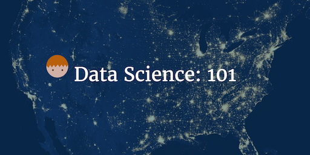

--- 
layout: post 
title: Data Science: 101 
author: Lewis Gavin 
comments: true 
tags: 
- datascience 
- machinelearning
- bigdata 
---

We've been recently looking at how to introduce data science concepts to the wider team, including business analysts, management and engineers.

This post is for anyone and everyone thats ever heard anything about Data Science but are still unclear on what it is, what it means for businesses and how to learn more.

## So What is Data Science?

Well the term Data Science itself is heavily overloaded. It's used in a bunch of different contexts to define a whole variety of different subjects. When trying to sell a concept like this, especially to management teams or senior stakeholders, a term that means nothing and is difficult to explain will simply just be ignored.

Bearing this in mind, we sat and tried to define what Data Science means to **us**, as depending on who you ask the answer will be slightly different. These answers range from using mathematical models to solve problems with data, investigating data to find insights, using machine learning to solve complex problems... and the list goes on.
What we wanted was a concise definition that brings together all these key Data Science concepts into one simple definition.

*"Data Science is the exploration, extraction and visualisation of insights from a variety of data types"* - and when you look at this, it's no different to what used to be called Business Intelligence or Business Analytics. Funnily enough - we don't think it is, it's a rebranding using some techniques that are exactly the same and others that are slightly matured due to the introduction of machine/deep learning techniques and higher computational power/Big Data/.

You might even have a Data Science team now with a different name...

## Why has it blew up?

This is an easy one to answer and the answer is a single word - **Data**.

Data used to be seen as something that was collected by scientist running experiments. This data was hopefully converted into information after the experiment and was represented in a way for others to consume and understand. 

As a Data Scientist, your job role is perfectly explained by that short passage above. You collect some data, explore it and run some "experiments" on a small sample, take your findings to a larger sample, learn something new and then represent your findings in a way that provides insight for the end user. 

The reason this has become more popular though is down to the vast amounts of data that is available to us. Data is easy to store, computational power is cheap and people interact with services that produce data all day every day. Pretty much every item we interact with on a daily basis has become data producer - and if it isn't now, it most certainly will be. 

With all this data available, we need people who are skilled to experiment and tell us things we dont already know. **Enter the Data Scientist**. Someone with an analytic mind that can think outside the box, apply mathematics and statistics and convey their findings in a user friendly way.

## Core concepts

Now everyone is on board with what Data Science is and understands why it is popular - it's time to share the core concepts so people can start to explore the domain further.

1. Data Exploration

Grab some data sets and go explore. You can learn a lot from the data by just looking at it. Find schema definitions, investigate API documentation and sift through some records manually. Look at the sort of data that's available, how well populated is it, what are some things you can see immediately that look interesting? What sort of questions could you answer? What data is missing and could supplement it?

This is a key activity to get a rough idea of what's possible and what further data is required to perform some analysis. It also gives you an idea of how the data looks ready for the next step.

2. Data Cleansing

If you read much around Data Science, you'll hear often that 80% of your time as a Data Scientist is spent cleaning data. As I mentioned earlier, the amount of data being produced by so many different sources means that this data isn't always in a standard format. Text data is especially messy as people write in different cases, use punctuation (correctly or incorrectly) and generally write in different styles. If validation is poor on the collection side, columns you expect to contain numeric values may contain unexpected values, you should never presume the data is correct unless it's being collected from a structured database that validates its input.

If you don't clean your data, your results will suffer. Clean data ensures consistent and more accurate results as data is in the format that you expect and require for your models to work effectively.

3. Data Analytics

Onto the fun part - Analytics. Now you've got a whole bunch of nice clean data, it's time to prove or disprove your hypotheses. If you are dealing with a huge data set, it's probably worth sampling the data into a sensible size to improve the speed of the exploritary analytics. There are a vast amount of analytics techniques using a number of different approaches. Machine learning and Deep learning are the poster boys, these techniques can be "taught" using mathematical algorithms to identify patterns in data. You supply the algorithm some data and with the data you provide the actual answer - for example, give the algorithm a bunch of sentences and label them as either positive or negative. The output will be a model, you can then give this model a sentence without the label and it will predict, based on what it "learnt" whether the sentence was positive or negative. 

There are a number of analytics techniques including simple mathematics: max, mean, average, etc., standard sql statements to join and/or perform calculations on the data, building functions programatically using languages such as R or Scala or using analytics tools such as SAS, Business Objects, Pentaho or many more.

4. Data Visualisation

You've found out some really interesting information, you've proven things you thought you knew and you've found out other things you never knew were important. Now you need to relay the findings to your peers, clients or management team. This is where visualisation is important. Telling a story with the data, representing it in a way thats easy to digest and in some cases making it interactive are all really important.

For some numbers based results you may find simple bar or line charts suffice. For demonstrating networks and linked entities, producing out a network graph might be useful. For textual based analysis you may want to build a table or a word cloud. Whatever your choice of visualisation technique, the visualisation should supplement and enhance the message of the information, not hinder it. Choose the visualisation due its practicality, not how flashy it looks. Again, there are tools such as SAS, Business Objects, etc. that you can use to visualise your data. However for something a little more bespoke you may find using a javascript library such as D3.js, Ember Charts or Google Charts are useful. 

*Just remember to keep to keep your visuals clean, practical and easy to understand.*

