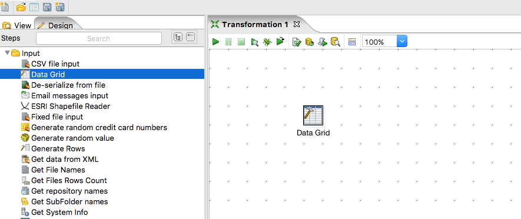
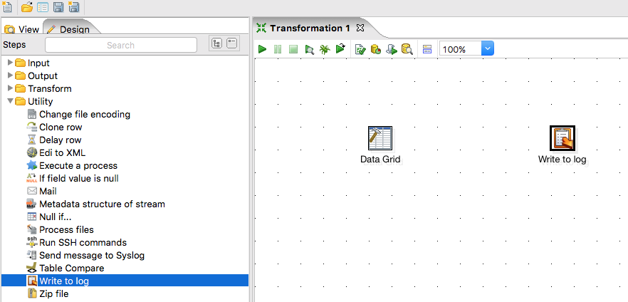
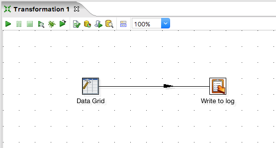
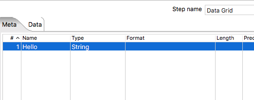
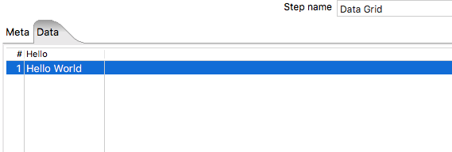
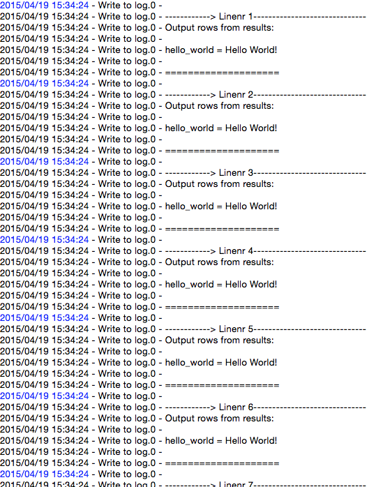

This is Part 1 in an _n_ part series about using the Pentaho Data Integration tool.

Pentaho DI (PDI) is an ETL tool that allows you to visually process data using a drag and drop interface. Within the series I am going to go through some of the basics then go into some more advanced use cases.

Since I'm new to the blog game, please feel free to leave feedback in the comments section on how I could improve!

##Transformations

Transformations are where 99% of the processing magic happens within PDI. 

A **Transformation** is a connection of steps that allow **ETL** processes to take place on top of data.

It allows rows to be input from a number of input sources, transformed and then output to a number of output sources (text files, databases, etc.).
*Steps* within a transformation are connected by **Hop**s that are one way channels demonstrating the flow of data.

Below is an example of a transformation with two steps and a hop.

## Steps
A **Step** is represented by an icon within the *Spoon* interface and usually performs a specific task. Each step is like a little function, and these functions can all be joined together to make the full program. _Sounds familiar right?_

In the above diagram there is a **Table Input** step that will bring in data from a database table and then a **File Output** step that will allow the data to be written to a file in a user specified location and format.

**Important characteristics:**

1. Step names must be unique within a transformation

2. Most steps can both read and write data (there are a few exceptions)

3. Steps can pass data to one or more other steps through hops (discussed next).

4. Most steps can have multiple outgoing hops

5. When a transformation is run, one or more copies of each step are initialised and run in their own thread - all these steps run simultaneously (or as parallel as possible).

6. Each step has a set of features that define its functionality.

## Hops
A **Hop** defines the data flow between two steps and is represented by an arrow.

A hop can take many forms such as: 

1. Always flow data to the next step (default for most steps).

2. Flow data if true or false - some steps can filter data in different directions based on a condition, this is represented in the image below for example, by the Filter Rows step using Green and Red arrows for True, False conditions respectively.

Below is an example of a Hops after filtering (notice the difference to the first image)

## Running your first transformation
The Hello world of PDI:

1. Open PDI and go to File > New > Transformation

2. On the left go the the Input folder and Drag and drop a _Data Grid_ step onto the canvas

3. On the left go to the Utility folder and drag and drop a _Write to log_ step to the right of the _Data Grid_ step.

4. Join the two steps together with a hop by holding _SHIFT_, click and hold on the _Data Grid_ and drag the mouse over to the _Write to log_ step then let go.

5. Double click on the Data Grid step, now we are going to insert some data. 
A Data Grid is like an excel sheet or a static table.
In the meta tab we can define the columns for our grid, make a column called **Hello** of type **String**.

6. Within the Data Grid step, now go to the _Data_ tab. You should see the **Hello** column. Insert some data in this column by clicking and typing within the grid.

7. Save the transformation by clicking save (top left)

8. Now lets run it! Hit the green play button towards the top of the canvas.
Once its run, you should see an _Execution Results_ panel display at the bottom of the page with a bunch of tabs. For now, select the _Logging_ tab. You should see your text displayed. The log will tell you that name of the step outputting the message, the column name (Hello) and the text you entered.

##Summary
Well thats it for this first part. Short, sweet and simple!

There are a vast number of different steps that would take an age to explain but are mostly really intuitive to use with the small amount of knowledge displayed in this post. Pentaho provide a set of [documentation](http://wiki.pentaho.com/display/EAI/Pentaho+Data+Integration+Steps) for each step that is very useful too.

Let me know if you want to see more of this :)

If you enjoyed this, please check out [PART 2](http://gavlaaaaaaaa.github.io/Pentaho-Jobs-Overview/)
