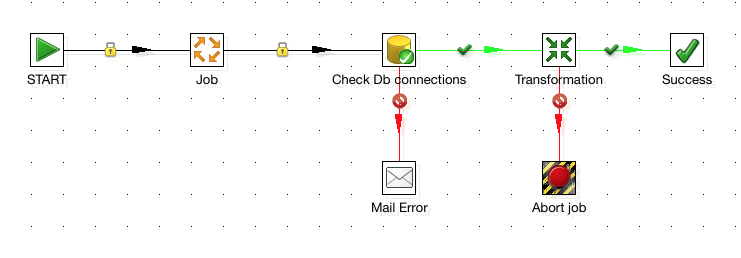

A **Job** allows high level steps to be strung together and is very useful for running maintenance style tasks such as verifying files or databases exists for example.

Due to the nature of maintenance tasks, its important that they are run in a specific order; Check database exists -> grab some data, you wouldn't want these tasks performed in a different order or in parallel. This is another reason why Jobs are used for these tasks, as unlike Transformations, they do not execute all steps in parallel.

Like transformations it uses the concept of steps and hops, however the steps are in the form of a Transformation, a Job or a job level step (maintenance style tasks).

The Transformation step simply allows you to plug in a previously created transformation and join it onto another step, for example:

**The first rule of any job is that it must begin with a 'Start' step**.

As you can see in the above example, the job begins with a *Start* and then strings two transformations together, but inbetween them
it does a job level step, which checks if a file exists.

You can also string whole jobs together in the same way as you do transformations, if you want to abstract up a level. Some important characteristics of Job entries are:

1. A job step will pass a result object between jobs steps. The result object contains rows and all these rows, once a particular job entry is completed, are passed together to the next job entry, and are not streamed.

2. By default job entries are executed in a sequence and only rarely are they executed in parallel.

3. You must have a start entry in order to begin the sequence of job steps.

## Job Hops
There are 3 types of job hops that can be used:

1. Uncoditional - the next job step will always excute, regardless of what happens in the previous step - this hop is a black arrow with a padlock on it.

2. Follow when true - the next job step attached will only execute if the previous job step executes successfully (completed with true) - this hop is green with a tick

3. Follow when false - the next job step attached will only execute if the previous job step execution was false/unsuccessful - this hop is red with a stop icon.

The following diagram shows an example of a job using the three different hop types.

Now we've got the basics of Transformations and Jobs down - in the next part of the series I am going to show you some cool, advanced things you can do with PDI such as: quickly and easily migrating from one database to another (MySQL to Hive), Metadata Injection and running Pentaho Map Reduce jobs on a Hadoop cluster.