This is Part 3a of the Pentaho series where I will be covering some more advance aspects of Pentaho DI by demonstrating its capabilites in migrating a set of databases from MySQL to Hive.

If you've missed [PART 1](http://gavlaaaaaaaa.github.io/Pentaho-Transformations-Overview/) or [PART 2](http://gavlaaaaaaaa.github.io/Pentaho-Jobs-Overview/) then you can always jump back!

## Migrating MySQL to Hive
With Big Data technologies becoming the norm for any large scale company, you may find yourself in the position where all of your existing databases and tables could do with being introduced to the new world... to kick-start your big data journey.

Hopefully by the end of this entry you will have enough understanding and inspiration to apply these techniques to **ANY** relational database in order to migrate it into Hive. 

_NOTE: although MySQL is used as an example, this approach can be applied to almost any database technology_

## Step 1 - Connecting to your MySQL instance
In order to get any data from MySQL we will need a list of tables to pull the data from, and in order to do this we need to set up a connection to the MySQL database.

We need to create a new transformation and add a _Get Table Names_ step, then double click to see how we configure it.
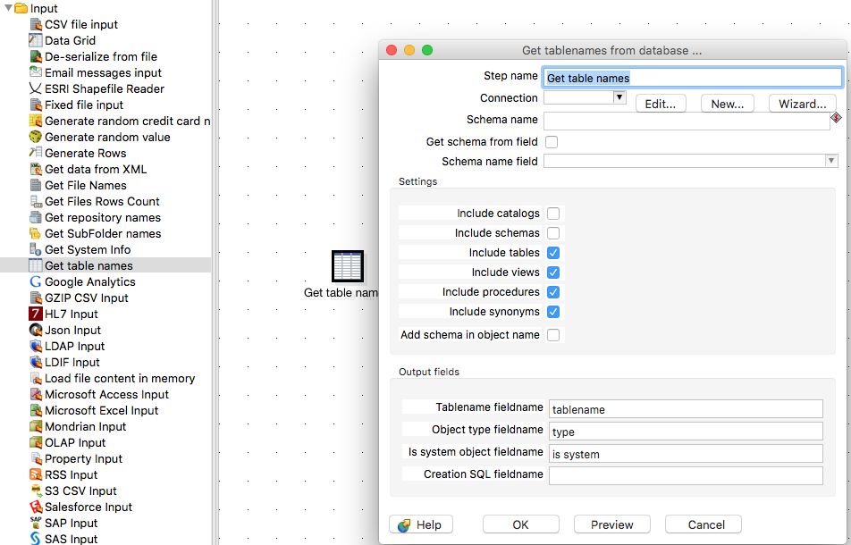

The second field asks for a connection, and to the right we have the choice of clicking _new_.
This brings up the database connection window where we can configure our connection. To connect to my local instance of MySQL my settings were fairly trivial.

_NOTE: You can test your connection from by clicking Test to make sure everything is correct!_

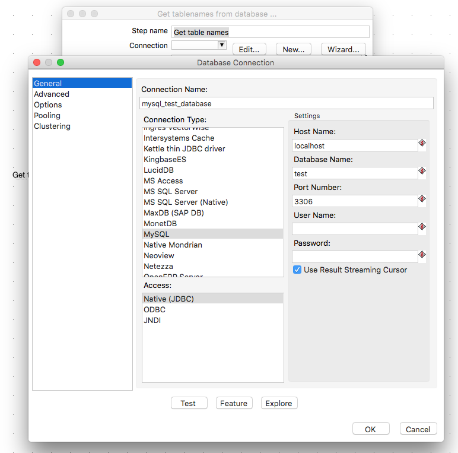

Now we can start to fill in the rest of the _Get Table Names_ step. I have a MySQL database named **test** that I am looking to migrate and I am only interested in the tables. If you wish to migrate views etc. then select those settings appropriately.

Then in the _Output fields_ section, I have filled in the _Tablename fieldname_ field with a field name for the list of tables that this step will output.

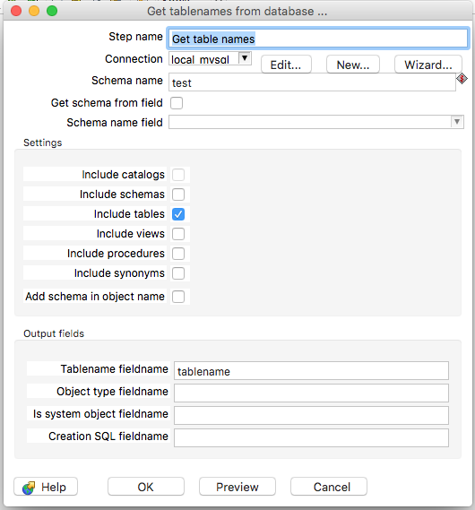

I don't want to use the table names that this step produced in this transformation - so I will simply connect it to a _Copy Rows to Result_ step ready to use at a later time. This completes this transformation - run it to check you get the list of table names you are expecting and save it with the name **get_tables**.

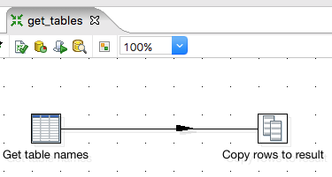

## Step 2 - Setting up the Job
We now have our intitial transformation that obtains a list of all the tables within a database for us.

Now we can set up the over arching job that will call the transformation we just made, and also another transformation that will use these table names to do the migration.

Set up a job as below - don't worry about what the second transformation is yet, we'll be building that in a moment.

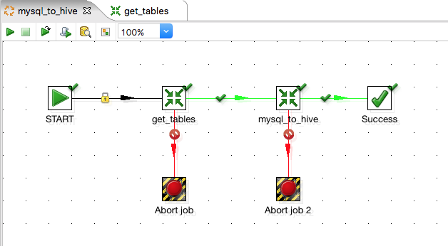

The first transformation will just be pointing at the get\_tables transformation we just created and doesn't require any more configuration. The second transformation is currently pointing at nothing, but we can configure it ready and go through the reasons why. Double click it and go to the _Advanced_ tab.

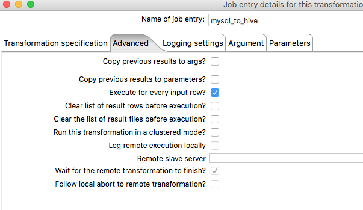

Here we just need to tick **Execute for every input row**. What this does is essentially tell Pentaho that for every row that is output from the previous transformation, execute this transformation that number of times, like a loop. 

Putting that into context for our example, lets say our get\_tables transformation fetches 3 tables from our MySQL database. The mysql\_to\_hive transformation would then execute 3 times - this means all steps inside it, from start to finish, are executed 3 times, one after another.

_Why would we want to do this you might be asking?!_

Flick to the Parameters tab and I'll explain why.

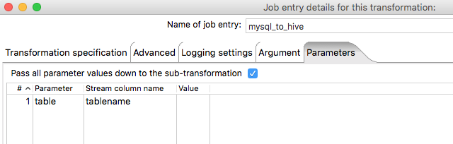

What we are doing here is saying that we want to pass a paremeter called _table_ into the transformation, and we are going to get its value from the **Stream** using the _Stream column name_ field. This allows us to pick up our **tablename** column we created in the previous transformation. 

This, linked with ticking _Execute for every input row_, means that for each table in that column it will execute this transformation and at the same time pass in the current table name as a parameter.

This will allow us to create the hive schemas and load the data from each table into hive one by one, until all tables are complete.

## Step 3 - Migrating the data

The next two steps presume you already have a Hadoop cluster configured with Hive installed and the Pentaho Big Data Plugin configured with your Hadoop instance. This is vital in order to do anything with Hive and HDFS from PDI. You'll stumble upon all the helpful documentation on this if you Google 'pentaho big data plugin'.

So we're all set up and now we need to start migrating the data. This is a really simple task and can be achieved in as little as **two steps!**. So let's make a new transformation. The first thing to do with this transformation is to configure it to take in the **table** parameter we set up in the previous step.

To do this simply double click anywhere on the grid, and in the window that pops up, go to the parameters tab and enter the world **table** in the first column. Simple as that! It's important that this matches the name we entered when configuring the Job above.

Now thats out the way, we will need a _Table Input_ step and a _Hadoop File Output_ step.

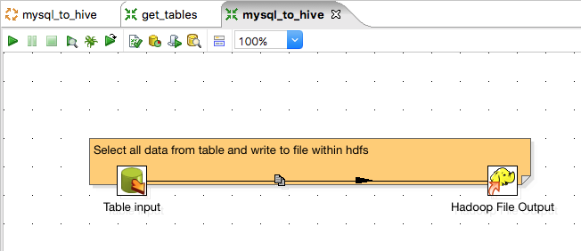

If you're wondering what the yellow label is in the background, it is something called a **Note**. Notes allow you to add comments to transformations and jobs, the same way you would add comments sections of code. To create one, simply right click on any blank space within the grid and click _New note_.

Anyway... I told you it would be simple right? Those two steps will do all the hard work in order to extract the data from each of our tables and write it to HDFS. Lets see how we configure them - double click the _Table input_ step.

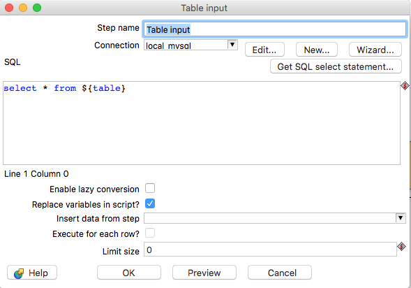

First things first, we need to select a connection from the drop down box. Our MySQL connection was configured in the previous transformation, so we can simply re-use this by selecting it.

The SQL is super simple too. We are simply going to select everything. The only oddity here is the **${table}**. This is how Parameters or Variables are referenced in PDI. At run time, the table name we are passing in will be substituted in the place of this parameter. **NOTE: In order for this variable substitution to take place, YOU MUST tick the Replace variables in script? box as shown above**. Otherwise, the variable will not be replaced.

One other thing to note from this step is the **Limit size**. By default it is set to 0 meaning that all the data returned by the select statement will be brought through, however if you have large tables and just want to take a sample, feel free to set this to a sensible value. When you're done, hit OK.

On to the _Hadoop File Output_ step, lets double click the step to configure it.

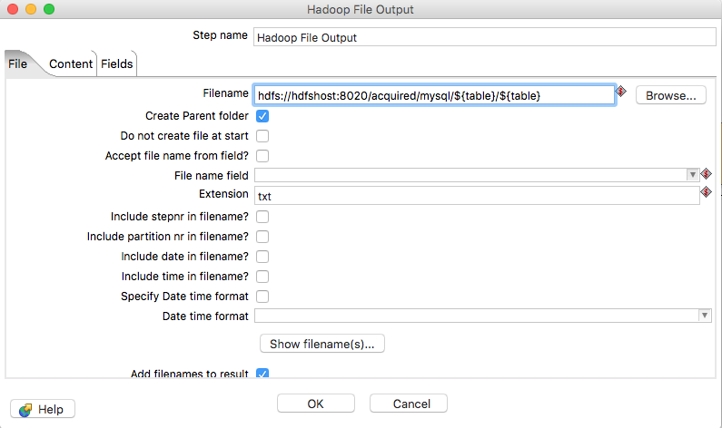

In this step we need to give a filename where we would like to output the data. Note you need to give the full hdfs path with host and port like shown. You can also use Variables/Parameters in this field (or any field with the grey diamond and red $ in it for that matter) so I used the table name as a folder name and also the name of the file.

The extension field will simply add a dot and the extension, in our case _TABLENAME.txt_. All the other steps are left as default, but they are pretty self explanitory if you wish to use them. Next we will need to configure hte _Content_ tab.

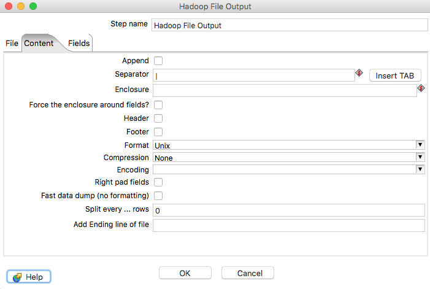

Here we need specify how the file is laid out. I want my files to be pipe delimited, as I know I dont have pipes in the data, I don't want a header or footer and I want the file to be Unix formatted. Easy...

We will be leaving the _Fields_ tab blank as this will write **all** columns that are brought in by our _Table input_ step to the file. This means we dont have to change it for each table as the schema changes, allowing it to be generic enough to use for each table.

Save this transformation and name it **mysql\_to\_hive** and then open up the Job we created with the same name. Double click the right most transformation and make sure it points at this new mysql\_to\_hive transformation.

You should now be able to run this job, and for each table within your MySQL database there will be a data file created within HDFS in /acquired/mysql/${table}/${table}.txt - check it out with a simple ls - hdfs dfs -ls /acquired/mysql/\*/\*

**Note: If you have large tables this may take a very long time to run - I recommend setting the Limit size field within the _Table input_ step to a value like 1000, just to get a small sample to prove the concept.**

## What's next?

I hope this was useful and that you will stay tuned for Part B of this post where I will further enhance the mysql\_to\_hive transformation to generate the Hive schemas to sit on top of the newly acquired data in HDFS.
