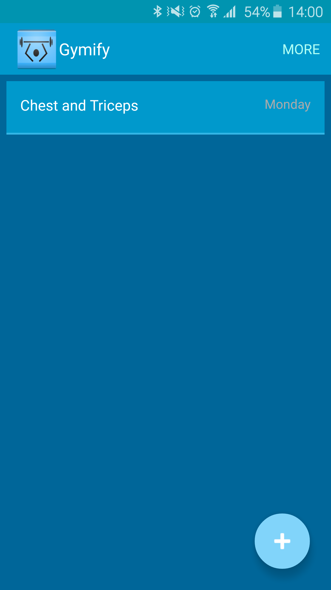

In this post I will be deviating slightly from the usual Big Data posts to talk about some pragmatism within my *in progress* android application; **Gymify**. The app is a gym session tracking application. Initially it is being developed for my own personal use, but I may publish it if I feel it gets to a good enough state. In reality it's a project to keep my programmer brain active.

The app makes use of lists, within lists, within lists. A list of days(that are essentially routines), that contain a list of Exercises for that Day, with each Exercise containing a list of Sets/Activities performed per the current session. Due to lists being a common theme within my application, I wanted a nice way to use get the optimal amount of re-use. The rest of this post will demonstrate how I did this.

## List View Adapters

`ListViewAdapters` are a common pattern used in android development when an application wishes to represent some information as a list. 

Some applications may have many lists. It is possible that these lists will all have the same general style. In my case, it will also mean that clicking an item in one list, will take you to another list.

The Java objects that are represented as items within a list may differ for each list, for example you may have a list of Car objects. When a car is selected you may wish to open a new list that contains location objects, stating where the car may be sold. In my case, I'll have a `Day` object, an `Exercise` object and a `Set` object.

The overall look and feel of these lists, along with a set of actions such as re-ordering or deleting will be common across them all. The differences will include the type of object contained within them and the way the information is displayed for each item. 

## List View Adapter Template

To avoid code duplication, you can set up an adapter *template* class that contains the core functionality. This class can then be *inherited* so child classes can make the most of these core features. The beauty of it being Templated allows the children to have different object types contained within the list. 

During the development of my Gymify application, I used a `ListViewAdapter` template class as follows:

~~~java

public abstract class ListViewAdapter<T> extends ArrayAdapter<T> {

    // objects to hold the list, contect and layout inflator (used later)
    protected List<T> list;
    protected Context context;
    protected LayoutInflater inflater;

    /* SparseBooleanArray that will be used to hold whether a list item has been selected or not
    this functionality will allow the user to select multiple list items and perform an action
    such as delete on multiple list items */
    private SparseBooleanArray mSelectedItemsIds;

    //basic constructor
    public ListViewAdapter(Context context, int resourceId, List<T> list) {
        super(context, resourceId, list);
        mSelectedItemsIds = new SparseBooleanArray();
        this.list = list;
        this.context = context;
        inflater = LayoutInflater.from(context);
    }

    // abstract getView function that must be defined by implementing classes
    public abstract View getView(int position, View view, ViewGroup parent);

    // function to remove items from the list
    public void remove(T object) {
        list.remove(object);
        notifyDataSetChanged();
    }

    // toggle a list item as selected or not selected
    public void toggleSelection(int position) {
        selectView(position, !mSelectedItemsIds.get(position));

    }

    //function used to cancel selection of items and reset the SparseBooleanArray
    public void removeSelection() {
        mSelectedItemsIds = new SparseBooleanArray();
        notifyDataSetChanged();
    }

    //function to add or remove list items to the selected items array
    public void selectView(int position, boolean value) {

        if (value){
            mSelectedItemsIds.put(position, value);
        }
        else{
            mSelectedItemsIds.delete(position);
        }
        notifyDataSetChanged();
    }

    //return the number of selected items
    public int getSelectedCount() {
        return mSelectedItemsIds.size();
    }

    //return a SparseBooleanArray of selected items
    public SparseBooleanArray getSelectedIds() {
        return mSelectedItemsIds;
    }

}

~~~

What I have implemented here is the skeleton for all other `ListViewAdapter` classes to extend on. This means that each `ListView` will have the multi-selection and deletion capabilites (this functionality is performed by a `MultiSelectListener` class that uses these helper functions), it will be inherently built in. However the way each list item is displayed, will be different for each `ListView`; hence the abstract `getView` function. This enforces the children classes to implement this themselves.

Due to the class containing an `abstract` function. The class itself must be `abstract`, meaning it cannot be instantiated, but that's ok, as I am going to make a different `ListView` class for each android `Activity` that will host my list.

### DayListViewAdapter

The `DayListViewAdapter` class is one of the classes I used to inherit from my `ListViewAdapter`. This class is now super simple. All it needs to do is provide a constructor that will simply call the `super` constructor and ensure it implements the `getView` function as part of the `ListViewAdapter` contract.

My implementation is as follows - it uses the parent inflater to create its `View` object passing in the xml layout file. This list item will simply show the name of the Day/Routine and on the far right, the day of the week that this routine is commonly performed on.

Heres a screenshot of what this will look like.

The code for this class as I said is really simple.

~~~java

public class DayListViewAdapter extends ListViewAdapter<Day>{

    public DayListViewAdapter(Context context, int resourceId, List<Day> list) {
        super(context, resourceId, list);
    }
    
    private class ViewHolder {
        
        TextView day;
        TextView weekday;
    }
 
    public View getView(int position, View view, ViewGroup parent) {

        final ViewHolder holder;
        if (view == null) {
            holder = new ViewHolder();
            view = inflater.inflate(R.layout.day_list_item_layout, null);
            // Locate the TextViews in listview_item.xml
            holder.day = (TextView) view.findViewById(R.id.dayName);
            holder.weekday = (TextView) view.findViewById(R.id.weekday);
            view.setTag(holder);
        } else {
            holder = (ViewHolder) view.getTag();
        }
        // Capture position and set to the TextViews
        holder.day.setText(list.get(position).getName());
        holder.weekday.setText((Day.weekdays[list.get(position).getWeekday().getMask()]));
        
        return view;
    }
}

~~~

## Outro

Hopefully this was helpful. I implemented the same style for my `ExerciseListViewAdapter` and made a `CardAdapter` class for recording Sets/Activities. Maybe I'll write a post on the generic Card View in the near future, as this was a really useful way to replicate the Google Card View layout before the API was available.

