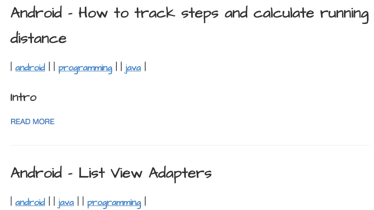
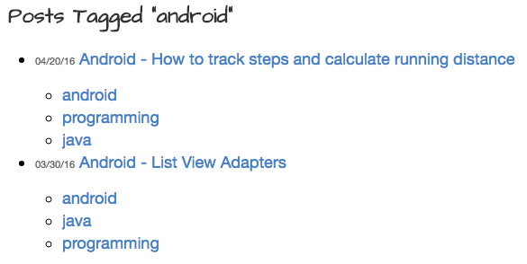

In this post I'll be explaining how I added tags to this website built using Jekyll and hosted on Github. I have a previous post explaining how I integrated Google Analytics and Adsense within the site too, you can find that post here: [Adding Google Analytics and Googe AdSense to a Jekyll Website](../Google-Analytics-Adsense)

## What are tags?

Tags can be used in a number of different scenarios. Within this post I will be exploring their relevance to blog sites in general. 

Within blogs they can be used to aggregate posts into categories, meaning each post is **tagged** with one or more keywords. These keywords usually relate to a category assoicated with the article. These tags can then be presented to the user and when clicked, open an index page listing all other posts that are also tagged with the same *tag*.

On my sites landing page [here](../) you will see that every blog post has one or more tags listed just below the post title like so

 

When you click on a tag - in the following example I click on the **android** tag - an index page is loaded listing all the other pages that also contain the **android** tag, it also lists all other tags on those pages too.

I will now explain how to tag pages and replicate this exact same functionality within your site.

## How to add it to your site

I am working on the assumption that you already have a Jekyll built site and are looking to add this functionality to it. Luckily Jekyll already supports tags, we just need to give it a helping hand to get it to in a way that suits our sites style.

### Adding tags to your pages

In the YAML header included on every page you can simply declare tags as follows:

~~~
layout: post
title: A post using tags
tags:
- development
- tags
~~~

That was simple, your page now has tags! Now we need to use this to generate a tag page listing all posts containing a particular tag.

### Generating tag pages

To generate an index page for every tag we will be using a small ruby application that can be obtained [here](https://github.com/danieldevries/jekyll-tag-generator/blob/master/tag_generator.rb) (not made be me).

Once downloaded, place this within the `_plugins` folder in your sites root directory. If you don't have a plugins folder then create one (make sure to remember the underscore) and put the file inside. This ruby code will automatically generate a page for every tag each time the site is built.

Now within the `_layouts` folder, add a file named `tag_index.html`. This file will be used to describe the layout of the tag page generated using the ruby script we just copied above.

It should contain something like the following - **Note: remove the dot after every opening curly bracket**

~~~html
---
layout: default
---
<h2 class="post_title">{.{page.title}}</h2>
<ul>
  {.% for post in site.posts %}
  {.% for tag in post.tags %}
  {.% if tag == page.tag %}
  <li class="archive_list">
    <time style="color:#666;font-size:11px;" datetime='{{post.date | date: "%Y-%m-%d"}}'>{.{post.date | date: "%m/%d/%y"}}</time> <a class="archive_list_article_link" href='{{post.url}}'>{.{post.title}}</a>
    
{.{post.summary}}

    <ul class="tag_list">
      {.% for tag in post.tags %}
      <li class="inline archive_list"><a class="tag_list_link" href="/tag/{{ tag }}">{.{ tag }}</a></li>
      {.% endfor %}
    </ul>
  </li>
  {.% endif %}
  {.% endfor %}
  {.% endfor %}
</ul>
~~~

Remember this can be customised to your liking.

### Building and Testing

You should now be able to build your site in the normal way using `jekyll build` - remember to place some tags within the headers of your posts. 

What you should notice is that within the `_site` folder you will have a `tag` folder. This should contain a directory for every tag name you included within your posts. Each directory will contain an `index.html` file that when viewed will show a list of every site containing that particular tag. Pretty cool!

Now we need a nice way to give users links and access to these pages.

### Linking to Tag pages

There are obviously a number of different ways you can present links to tag pages. You could have a sidebar containing the most popular tags, allow them to be searched for or filtered or supply them within every post. I decided that I wanted them displayed under the post title on my sites home page. I'll now share how I did this.

Within my `index.html` page, that creates a list of every post within the site, I simply added a for loop that iterates over the tags within each posts YAML header. I then create a link to each of the tags folders (remember they will be within /tag/Tag_Name). I do this just underneath each posts title. My index.html looks like so - **again remove the dot after every opening curly bracket**

~~~html
---
layout: default
---

  {.% for post in site.posts %}
    <article class="post">

      <h1><a href="{{ site.baseurl }}{{ post.url }}">{.{ post.title }}</a></h1>
      <h5><i class="icon-tags"></i> {.% for tag in post.tags %}| <a href="/tag/{{ tag }}" title="View posts tagged with &quot;{{ tag }}&quot;"><u>{.{ tag }}</u></a> |  {.% if forloop.last != true %} {.% endif %} {.% endfor %}</h5>

      

        {.{ post.excerpt }}
      

      <a href="{{ site.baseurl }}{{ post.url }}" class="read-more">Read More</a>
    </article>
  {.% endfor %}

~~~

## Wrap up

Now you should have successfully added tags to your site and should understand how to present links to them from your homepage. Hopefully you found this interesting, please feel free to comment and provide feedback or ask questions below :)

