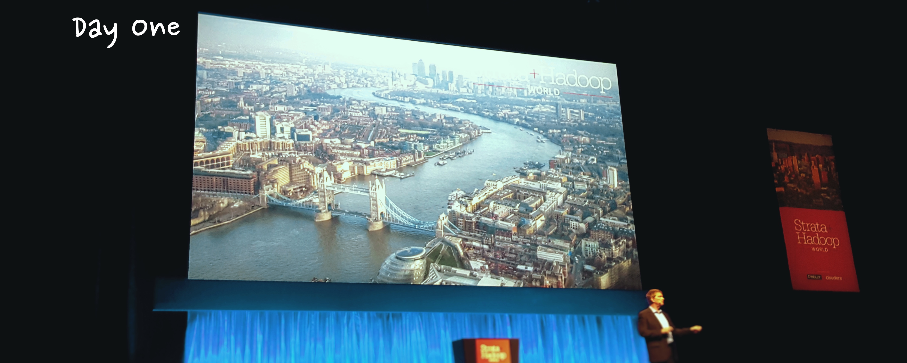
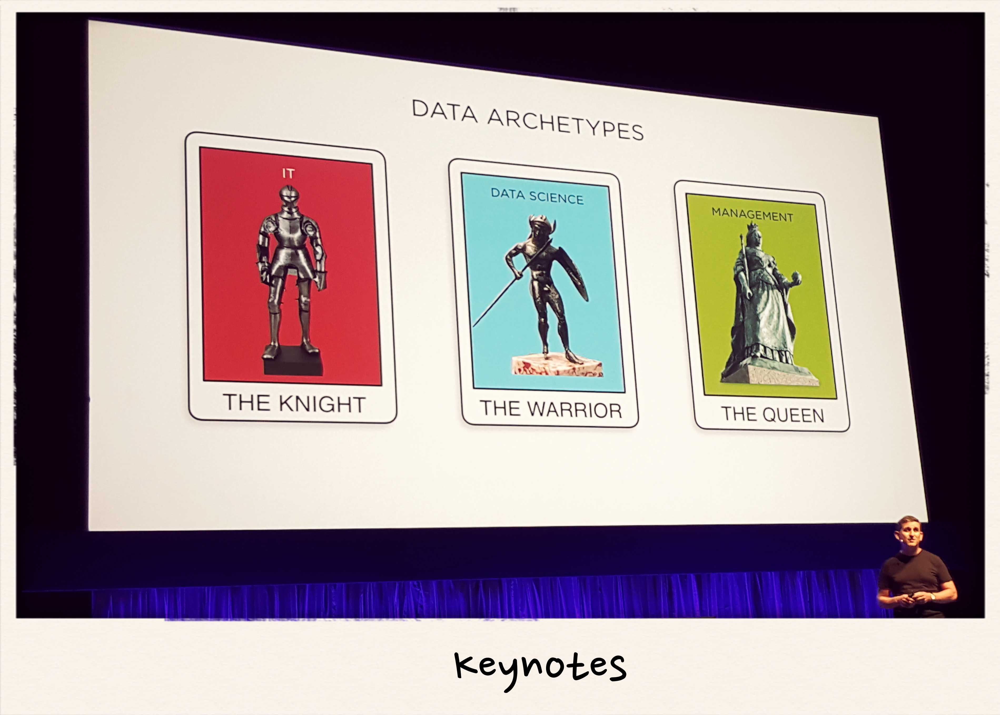
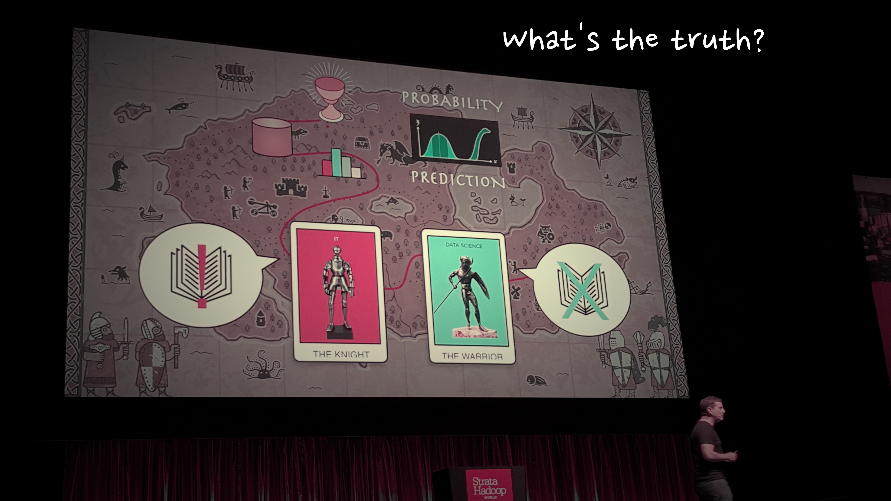
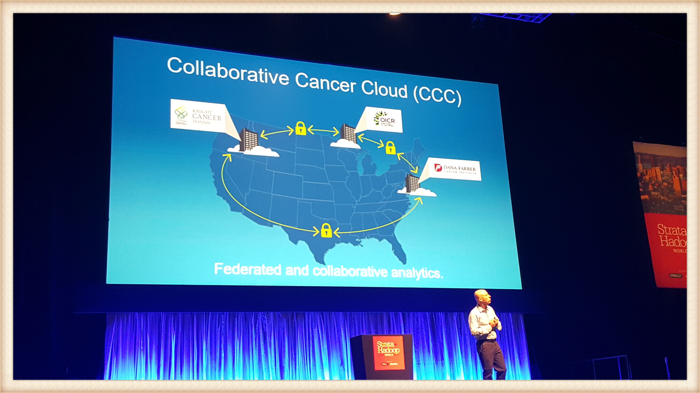
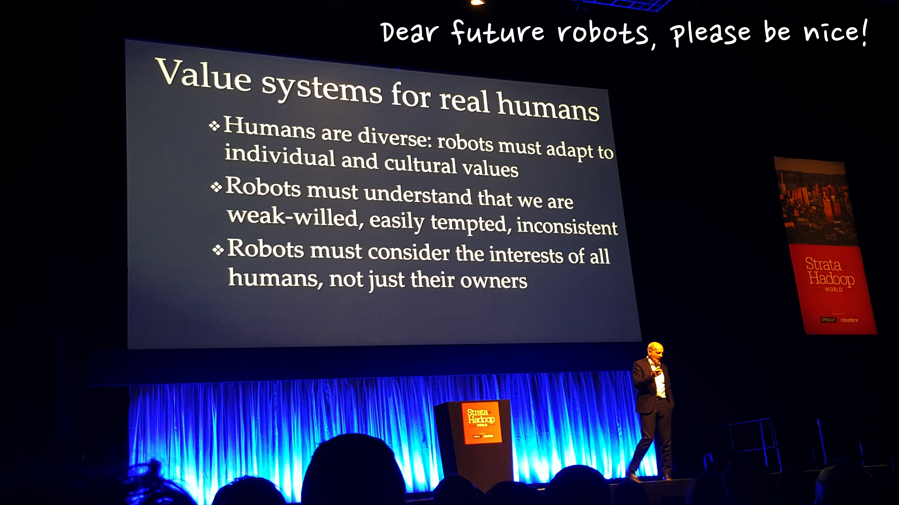

## Thursday 2nd June

Strata + Hadoop world program chairs: Roger Magoulas, Doug Cutting and Alistair Croll kicked off the first day of conferences. They gave warm introductions and were pleased with the turn out. This year 2,000+ people showed up selling out the ExCel! This is a huge achievement and shows the growth of the Big Data scene in recent years.

The keynotes started with speakers from many of the big players within the data space. For me, there were two standout keynotes from the day. Joe Hellerstein gave a talk on Context Services and finding the truth from a large lake of data. Stuart Russell followed this with a talk on AI. Stuart talked about the concerns with AI and how we should be thinking about solving them.

### Modern Data Strategy at CERN  - (Mike Olsen, Cloudera)

Mike discussed how CERN uses Hadoop for analysing data from particle collisions. One major lesson, that I think one can take away from this, is the importance to embrace change. Technology changes, so preparation is key to evolve with it. He also stated that choosing the right data storage formats is key. Consider them on a case by case basis for each area of the cluster, depending on the use case.

### The Internet of Things: It’s the (sensor) data, stupid - (Martin Willcox, Teradata)

Sensors sometimes lie. They can give incorrect readings so need management. This means they also do not always tell us the whole truth. Trying to give one version of the truth in some cases can mean ignoring data, or not using it as intended. 

Martin believes it's important to keep the data as raw as possible. It's interpretation is then dependant on the users. You can then build more consolidated layers above this where appropriate.

### Data Relativism and the rise of Context Services - (Joe Hellerstein, UC Berkeley)

Joe delivered an impressive presentation on the quest for the truth by an “IT Knight” and a “Data Science Warrior”. This was definitely one of the best delivered keynotes. He explained how “IT Knights” can ask philosophical questions e.g. “What is the meaning of life?” and expect an exact answer. 
On the flip side, a “Data Science Warrior” bases answers on probability and prediction. These two versions off the truth often conflict and this is why context services are on the rise. There are many versions of the truth and what matters is the context. IT Knights should work with Data Science Warriors to sift through the large lake of data to find the contextual truth.

### Saving Whales with Deep Learning - (Piotr Niedźwiedź, deepsense.io)

My biggest take away from this talk was the flexibility of Deep Learning algorithms. Piotr demonstrated their capability to identify whales using images taken from above. It works by learning the head location and face patterns of each whale. Then it applies this to identify new pictures. He stressed deep learning is often an unknown solution for many business problems. At the same time data scientists don't know the business problems that are out there. The gap needs bridging!

### Analytics innovation in Cancer research - (Gilad Olswang, Intel)

96% of Cancer data is siloed by different organisations and institutions. Moving this data between users can be difficult due to not only its size, but its protection. Gilad presented the idea of a “huge map reduce” paradigm to send analytics to the data instead. Yet this can be difficult, again due to concerns around securing the data. To enable security Intel built a Collaborative Cancer Cloud to distribute analytics across businesses.

### The future of (Artificial) Intelligence - (Stuart Russell, UC Berkeley)

AI is already out there and improving as shown with the alpha go project. There are AI projects such as Net-Visa that locate and track nuclear explosions.  Future AI systems include: self driving cars, smart personal assistants and Q/A systems that know everything! 

AI will make better decisions and solve some of humanities hardest problems. This is due to the vast amount of data and infinite amount of “thinking time” available to AI systems. To ensure these decisions are human friendly, we need to align our needs with the AI. Stuart recited the story of King Midas who wished that everything he touched turned into gold - apart from his water, food, children etc. It's as if a robot carried out this wish and this is not the AI we want. We want AI that has common sense and doesn't take everything literally yet understands it’s purpose is to benefit humans.

