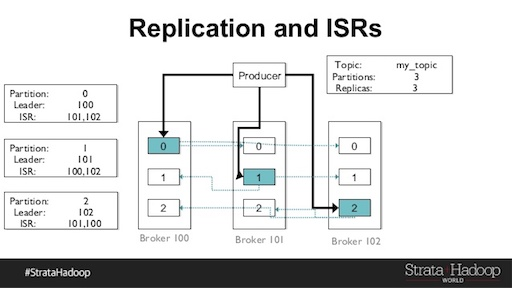

With data flowing and updating from ever more sources, businesses are looking to translate this data into insights to make key business decisions. Real time data streams have become more popular due to the Internet of Things (IoT), sensors and social media. These platforms provide ever changing states. Analysing them a day later can give misleading or now currently false information.

Streaming allows consistent data ingestion. There were a few flaws that prevented real time streaming being ubiquitous in the past. One major problem was loss of data if there was a fault. Another was that real time tools weren't able to keep up with the velocity.

Newer streaming technologies such as Apache Kafka have helped resolve some of these issues. Kafka is a publish-subscribe message system. It provides isolation between data producers and data consumers. It also allows intermediate storage and buffering of data to help with large velocities. 

When choosing a streaming platform, there are three main things to consider: Reliability, throughput and flexibility. Kafka is capable of providing each of these in its own way.

To ensure reliability, Kafka uses replication. One replica is the designated leader. The others follow and fetch data from the leader. This means every partition has a leader to fetch from. If any partition goes down another is there to fetch from.

 

_Image taken from http://www.slideshare.net/gwenshap/kafka-reliability-when-it-absolutely-positively-has-to-be-there_

Kafka is also fast. This [article](https://engineering.linkedin.com/kafka/benchmarking-apache-kafka-2-million-writes-second-three-cheap-machines) explains how to benchmark Kafka. They found it can perform 2 million writes per second on cheap hardware. One of the main reasons is the direct calls to the OS kernel to move data. It also avoids random disk access due to writing sequential, immutable data (called a commit log). Finally it can scale sideways meaning it can write to thousands of partitions spread over many machines.

It's flexibility comes from the decoupling of producers and consumers. Consumers keep track of what they have consumed rather than producers dictating the stream. Due to producers persisting data immediately to disk you can then pause consumers - once restarted they continue consuming from where they left off. This decoupling also allows streaming from the source once and consuming many times by many applications.

## Summary

Real time streaming has been made easy. There are many ways to consume and visualise this data in real time. I'll be looking into how this can be done using Druid and also storing data for fast reporting using Apache Kudu in later posts.

