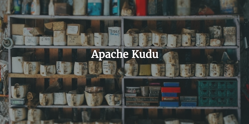

Apache Kudu is a data storage technology that allows fast analytics on fast data. Cloudera kickstarted the project yet it is fully open source. Kudu provides fast insert and update capabilities and fast searching to allow for faster analytics. It sits between HBase and Impala with Parquet, attempting to remove the trade offs between quick scans and rapid random access.

*Picture by Cloudera*

What makes Kudu stand out is funnily enough, its familiarity. Like traditional relational database models, Kudu requires primary keys on tables. Tables have columns and primitive data types and **support updates**. If you are migrating a relational database to a Hadoop cluster, maintaining updates/deletes can be a challenge.  This is due to "database" tools sitting directly on top of HDFS. Due to HDFS being a write once architecture, updating rows can be difficult as you essentially have to replicate this functionality by re-writing the underlying data.

## So, how does it work?

It does not use HDFS. It can however coexist with HDFS on the same cluster. There are multiple reasons for this design decision that you can find on the [Kudu FAQ page](http://kudu.apache.org/faq.html). 

Every table must have a primary key that must be unique. This acts as an index to allow quick access for updates and deletes. Tables are composed of Tablets, which are like partitions. Tablets are replicated across multiple nodes for resiliance. Data is stored in a columnar fashion. This means that columnar aggregations are quicker due to all data in each column being stored sequentially. This also means data can be vectorized and compressed easier because all data per column is of the same type.

*Picture from kudu.apache.org*

Although Kudu sits outside of HDFS, it is still a  "good citizen" on a Hadoop cluster. It can share data disks with HDFS nodes and has a light memory footprint. It also allows you to transparently join Kudu tables with data stored elsewhere within Hadoop including HBase tables.

## How do I use it?

Tables are self describing meaning that SQL engines such as Impala work very easily with Kudu tables. Spark can also be used to analyze data and there are Java and C++ API's availble too. The simplest way to give Kudu a try is to use the [Quickstart VM](http://kudu.apache.org/docs/quickstart.html). This shows you how to create a Kudu table using Impala and port data from an existing Impala table, into a Kudu table. Using the Impala_Kudu application - that can be installed alongside the default Impala install - you can perform standard Impala queries but also issue update commands.

If you are considering migrating a data warehouse into Hadoop and don't want the hastle of redesigning your schemas to suite the NoSQL movement, Kudu may be the tool for you. However don't be too hasty as it is still in beta but looks a promising prospect for the future. 

## Summary

Kudu is designed for speed in both bulk and random access read/write scenarios. It's compatibly with standard SQL engines makes it easy to adopt along with its compatibility with the rest of the Hadoop ecosystem.

Remember Kudu isn't supposed to replace HDFS or HBase - both have their unique use cases. As always, it's important to choose the right tool for the right job. I hope this 5 minute overview has sparked your interest to at least try Kudu out like I did.

