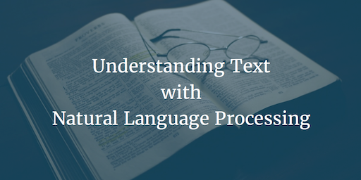

--- 
layout: post 
title:  Understanding Text with Natural Language Processing
author: Lewis Gavin 
comments: true 
tags: 
- machinelearning 
- nlp
- computerscience 
---

This weeks post is on Natural Language Processing, a computer science field that is now closely linked into the Data Science and Machine Learning worlds, especially since the explosion of AI.

## What is it?

Natural Language Processing is the concept of analysing natural language, wether thats text, speech or whatever, and giving it some meaning specifically to aid with human and computer interaction.

*So what does all that mean?*

Essentially, it is trying to quantify grammers, words or phrases so that word types, relationships and even sentiment can be identified. 

The Stanford NLP team have done some great work within this area and have produced some fantastic products that give you as a developer, data scientist or <insert job title of the month here> the ability to extract meaning from human language, programatically!

I used the Stanford Core NLP recently to analyse technology papers from the internet to pull out contextual information such as peoples names mentioned in the document, companies and even monetary values and indexed them within Elasticsearch along with the original document. This then allowed a comprehensive search suite giving contextual information back with each document.

### How Does it Work?

I'm going to base all my examples from the Stanford CoreNLP application. This is not only because I am familiar with it but also because it is really simple to use!

To give you a visual idea of how it works, I've taken the following image from the Stanford Core NLP page.

 

Looking at the Named Entity Recognition section, it shows parts of the sentence that it has identified and *tagged*.  From this you can see how easy it would be to obtain people, companies and locations from this text.

It is obviously more advanced than just picking out names. The Basic Dependencies image shows how the application links all the words together to give a really rich description of the grammar of the scentence. 

### How can I start to use it?

Start by [downloading the CoreNLP application](http://stanfordnlp.github.io/CoreNLP/#download).

Once downloaded unzip the file and ensure you have Java installed. Now from a terminal window if you `cd` into the unzipped folder you can then run the following command:

~~~
java -mx4g -cp "*" edu.stanford.nlp.pipeline.StanfordCoreNLPServer
~~~

This will start running the server. From your browser if you then go to `localhost:9000` you should see a nice web front end. This will give you the opportunity to have a play by inputting your own text and seeing a visual representation of how the application processes the text.

However if you wanted to use this in your own application, the nice GUI may not be what you're looking for. Luckily, the CoreNLP server also lets you produce output files containing the tags that you saw in the image above. 

To use this, make sure the server is running by running a similar command to the one above but using nohup to put it in the background.

~~~
nohup java -mx4g -cp "*" edu.stanford.nlp.pipeline.StanfordCoreNLPServer &
~~~

Once this is up and running we can then start sending data to the server to be parsed, and tell it to output the results as a text file to be parsed later.

I'm using one of my Markdown documents from a previous [post](http://www.lewisgavin.co.uk/Strata-Hadoop).

~~~
wget --post-file Strata-Hadoop.md 'localhost:9000/?properties={"tokenize.whitespace":"true","annotators":"tokenize,ssplit,ner","outputFormat":"text"}' -O strata_parsed.txt
~~~

Here I am telling the server that I am sending a file (called Strata-Hadoop.md) and that I would like it to annotate/tag it using the tokenize, ssplit and ner settings. The important one is the **ner** annotator, as this gives us the NamedEntityTag in our output, that tells us whether the word is part of a persons name, an organisation or even a date. It will then output to a file called strata_parsed.txt in text format (you can use json, xml and many others for the outputFormat)

The output looks something like this.

~~~
[Text=the CharacterOffsetBegin=653 CharacterOffsetEnd=656 PartOfSpeech=X Lemma=the NamedEntityTag=O]
[Text=day. CharacterOffsetBegin=657 CharacterOffsetEnd=661 PartOfSpeech=X Lemma=day. NamedEntityTag=O]
[Text=Joe CharacterOffsetBegin=662 CharacterOffsetEnd=665 PartOfSpeech=X Lemma=joe NamedEntityTag=PERSON]
[Text=Hellerstein CharacterOffsetBegin=666 CharacterOffsetEnd=677 PartOfSpeech=X Lemma=hellerstein NamedEntityTag=PERSON]
[Text=gave CharacterOffsetBegin=678 CharacterOffsetEnd=682 PartOfSpeech=X Lemma=gave NamedEntityTag=O]
[Text=a CharacterOffsetBegin=683 CharacterOffsetEnd=684 PartOfSpeech=X Lemma=a NamedEntityTag=O]
~~~

As you can see, we get the original word, the character offsets and also the *NamedEntityTag*. As you can see it picks out Joe Hellerstein as a **PERSON**.

This output file can now be read by a python application for example to extract all people names, and organisations. You can do it with a quick grep statement just to prove the use case.

~~~
grep -a -i "NamedEntityTag=PERSON" strata_parsed.txt
~~~

Outputs:

~~~
[Text=Lewis CharacterOffsetBegin=65 CharacterOffsetEnd=70 PartOfSpeech=X Lemma=lewis NamedEntityTag=PERSON]
[Text=Gavin CharacterOffsetBegin=71 CharacterOffsetEnd=76 PartOfSpeech=X Lemma=gavin NamedEntityTag=PERSON]
[Text=Alistair CharacterOffsetBegin=254 CharacterOffsetEnd=262 PartOfSpeech=X Lemma=alistair NamedEntityTag=PERSON]
[Text=Croll CharacterOffsetBegin=263 CharacterOffsetEnd=268 PartOfSpeech=X Lemma=croll NamedEntityTag=PERSON]
[Text=Joe CharacterOffsetBegin=662 CharacterOffsetEnd=665 PartOfSpeech=X Lemma=joe NamedEntityTag=PERSON]
[Text=Hellerstein CharacterOffsetBegin=666 CharacterOffsetEnd=677 PartOfSpeech=X Lemma=hellerstein NamedEntityTag=PERSON]
[Text=Stuart CharacterOffsetBegin=759 CharacterOffsetEnd=765 PartOfSpeech=X Lemma=stuart NamedEntityTag=PERSON]
[Text=Russell CharacterOffsetBegin=766 CharacterOffsetEnd=773 PartOfSpeech=X Lemma=russell NamedEntityTag=PERSON]
[Text=Stuart CharacterOffsetBegin=807 CharacterOffsetEnd=813 PartOfSpeech=X Lemma=stuart NamedEntityTag=PERSON]
[Text=Mike CharacterOffsetBegin=1003 CharacterOffsetEnd=1007 PartOfSpeech=X Lemma=mike NamedEntityTag=PERSON]
[Text=Martin CharacterOffsetBegin=1740 CharacterOffsetEnd=1746 PartOfSpeech=X Lemma=martin NamedEntityTag=PERSON]
[Text=Joe CharacterOffsetBegin=2022 CharacterOffsetEnd=2025 PartOfSpeech=X Lemma=joe NamedEntityTag=PERSON]
[Text=Piotr CharacterOffsetBegin=2908 CharacterOffsetEnd=2913 PartOfSpeech=X Lemma=piotr NamedEntityTag=PERSON]
[Text=Gilad CharacterOffsetBegin=3546 CharacterOffsetEnd=3551 PartOfSpeech=X Lemma=gilad NamedEntityTag=PERSON]
[Text=King CharacterOffsetBegin=4494 CharacterOffsetEnd=4498 PartOfSpeech=X Lemma=king NamedEntityTag=PERSON]
[Text=Midas CharacterOffsetBegin=4499 CharacterOffsetEnd=4504 PartOfSpeech=X Lemma=midas NamedEntityTag=PERSON]
~~~

## Wrap up

As you can see, using this application is really simple and allows you to reap all the benefits of Natural Language proccessing without having to implement your own complex parser. Due to the CoreNLP being available as a server, you can also deploy it to be run within a production environment and have applications processing and tagging text.

Earlier I mentioned that I had used this to obtain contextual information from documents scraped from the internet, but there are many other use cases and features to try, so why not give it a go!

