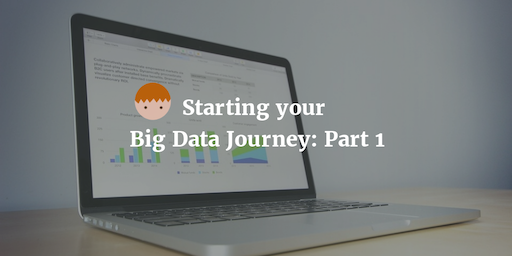

--- 
layout: post 
title:  Starting your Big Data Journey with Cloudera and Pentaho Part 1
author: Lewis Gavin 
comments: true 
tags: 
- docker 
- hadoop
- pentaho 
---

This is the first part of a multi-part series aimed at demonstrating how to get started in the big data world. The series will include setting up a sandbox environment, ingesting and transforming data with Kafka and Spark and Visualising data using Pentaho BA.

## Getting Started

To get started make sure you have [docker]() installed on your machine. Once that is done simply go the [Cloudera Quickstart Docker]() page and follow the really intuitive step by step guide. I will include the instructions for the machine I used below too for reference. (Ubuntu 16-04-1 OS with Docker 1.10.3)

1. Pull the latest version of the VM

~~~bash
docker pull cloudera/quickstart:latest
~~~

2. Run the Image

**Note:** I have used the `-p` flag to specify which ports I want to be available to my host machine. Port `8888` is for Hue and `8080` will be used for Pentaho BA.

~~~bash
docker run --hostname=quickstart.cloudera --privileged=true -t -i -p 8888 -p 8080 cloudera/quickstart /usr/bin/docker-quickstart
~~~

It's as simple as that - once all the services have started you should be within a shell inside your docker container!

## Accessing applications from your local machine

Within the shell you have access to the full CDH stack now and can start using `impala-shell` or `beeline` at your leisure. However, what happens when you want to start usng a GUI tool through your browser like **Hue**?

The default port for hue is `8888` however if you open your browser and go to `localhost:8888` you should find that nothing happens (Unless you already have a service running on this port locally). Earlier, when starting the container we used the `-p` parameter withn `8888`. This maps the port to our local machine but to a diferent IP. To find out the IP it has been assigned locally we use the docker ps command.

~~~bash
$> docker ps
CONTAINER ID        IMAGE               COMMAND                  CREATED             STATUS              PORTS
187ace38dbe2        13244abe324dc       "/usr/bin/docker-quic"   13 hours ago        Up 13 hours         21050/tcp, 0.0.0.0:32773->8080/tcp, 0.0.0.0:32772->8888/tcp, 0.0.0.0:32771->9876/tcp  

~~~

We can see the port `8888` has been mapped to `32772` so by going to `localhost:32772` from our browser will open up Hue!

Ports `8080` and `9876` have also been opened. `8080` will be used for Pentaho BA and I opened `9876` for any other simple http server I may want to boot up.

## Installing Pentaho BA

You may want to install Pentaho on your local machine and configure it to use your hadoop cluster within the docker container, however to keep it simple and avoid the potential issues with this method, we will install it inside of the contanier.

If you haven't already, boot up your container using the command from earlier. **Make sure you have the `-p 8080` param set when you run**. To install Pentaho BA go the [Community Edition download page](http://community.pentaho.com/) and download the zip file within the container. Copy the link address and use wget. 

~~~bash
wget pentaho-download-file.gzip
~~~

Unzip the contents of the download file to a suitable location and navigate to the folder `biserver-ce/pentaho-solutions/system/kettle/plugins/pentaho-big-data-plugin`. We now need to configure Pentaho to use the big data shims in order to talk to our CDH instance. 

1. Open up the plugin.properties file and ensure you set the following

~~~bash
active.hadoop.configuration=cdh55
~~~

This should be the version of CDH you have minus any special characters (5.5 becomes cdh55). It's likely that you will have a later verson of CDH than the latest CDH instance that Pentaho supports. However I found that cdh55 works with cdh5.7.

2. Copy the following files from your CDH folders to `hadoop-configurations/cdh55` and overwrite the files that already exist

~~~bash
yarn-site.xml
mapred-site.xml
hive-site.xml
hdfs-site.xml
core-site.xml
hbase-site.xml
~~~

3. Within the same directory open the `config.properties` file and add the following config entry

~~~bash
authentication.superuser.provider=NO_AUTH
~~~

This tells Pentaho that we aren't using a kerberos authenticated cluster.

4. Start the Pentaho BA server by going back to the root directory of the install `biserver-ce/` and running

~~~bash
./start-pentaho.sh
~~~

This will start all the necessary services. To track the service bootup you can tail the log in `/biserver-ce/tomcat/logs/catalina.out`.

5. Find out the local port that has been mapped for port 8080 using `docker ps` like we did earlier. Then go to your browser and go to the address.

You should see the Pentaho BA login console. To login the default username is `admin` and the password is simply `password`.

## Saving your Container

Now you've gone to the trouble of downloading, installing and configuring Pentaho, it would be nice if those changes could be saved so the next time the container is booted up, we can start where we left off.

**DO NOT EXIT FROM YOUR CONTAINER UNTIL YOU HAVE DONE THIS**

Open another termainal windown and run the `docker ps` command - we need the 
**CONTAINER_ID**. We can then use the `docker commit` command.

~~~bash
$> docker commit <CONTAINER_ID> cloudera/quickstart
~~~

If you now run `docker images`, it should show the cloudera/quickstart image with a very recent CREATED time.

To take this a step further and ensure Pentaho is started everytime we run the image, we can just modify our startup command slighly.

**From:**

~~~bash
docker run --hostname=quickstart.cloudera --privileged=true -t -i -p 8888 -p 8080 cloudera/quickstart /usr/bin/docker-quickstart
~~~

**To:**

~~~bash
docker run --hostname=quickstart.cloudera --privileged=true -t -i -p 8888 -p 9876 -p 8080 cloudera/quickstart /bin/bash -c "/opt/biserver-ce/start-pentaho.sh;/usr/bin/docker-quickstart"
~~~

We're simply chaining the commands to execute inside the container, to include the Pentaho startup command followed by the startup script provided by Cloudera thats starts all the CDH services.

## What's Next?

That's it for Part 1 of this series. In the next parts of this series I am going to show how to install and configure **Apache Kafka**, build a Kafka and Spak application to ingest and transform data and then serve this data to a Pentaho BA report and CDE dashboard.

Make sure you follow me on [Twitter](http://www.twitter.com/gavlaaaaaaaa) and [subscribe to my weekly newsletter](http://eepurl.com/b8r2XH) so you dont miss out on the rest of the series!