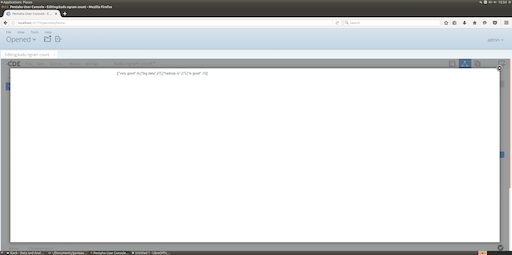
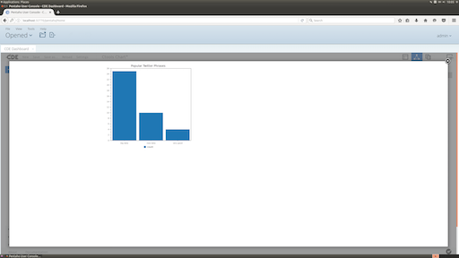

--- 
layout: post 
title:  Real Time Pentaho CDE Dashboard, Big Data Journey Part 4
author: Lewis Gavin 
comments: true 
tags: 
- docker 
- hadoop
- pentaho 
---

This is the final post in the Big Data Journey blog series. So far we have looked at [installing CDH and Pentaho BA using Docker](http://www.lewisgavin.co.uk/CDH-Docker), [ingesting data with Kafka and Spark](http://www.lewisgavin.co.uk/Data-Ingestion-Kafka-Spark) and then in the last post, we looked at [transforming and storing that data in Apache Kudu](http://www.lewisgavin.co.uk/Kudu-Spark). In this final post, we will look at reporting on top of our beautifully ingested and transformed, real time data feed. This will involve using Pentaho CTools to build a simple chart that will update based on the latest picture within our data feed.

## Pentaho CTools - What is it?

CTools is a set of visualisation and dasboarding tools that sit on top of Pentaho BA. Within the community edition of Pentaho we installed in [part 1](http://www.lewisgavin.co.uk/CDH-Docker), you get access to CDE - Community Dashboard Editor. This allows you to create HTML and Javascript dashboards that use Pentaho BA to serve the data. Data sources can be created to obtain data from a number of different sources out of the box, including Impala! This will allow us to query our impala table and then visualise the results.

Going over all of the basics in this post would be a mammoth task and considering Pentaho have already gone to the trouble, you can use their [overview of CDE](https://help.pentaho.com/Documentation/6.1/0R0/CTools/CDE_Dashboard_Overview) and [CDE quickstart guide](https://help.pentaho.com/Documentation/6.1/0R0/CTools/CDE_Quick_Start_Guide) to get you up to scratch. For the remainder of this post, I'll presume you know some basic html and are at least a little bit familiar with CDE.

## Creating a Connection

Connect to docker and make sure the port for Pentaho BA is open for ease of use. Make sure Pentaho is running by going to the biserver-ce folder (if you followed my instructions it will be in `/opt/biserver-ce` and run `./start-pentaho.sh`). Now within a terminal window (outside of the docker container) run docker ps and see which local port has been mapped to `8080`.

Now open up a browser and go to the port you found above. The Pentaho BA login page should appear. To login as admin the details are: username = admin, password = password.

Once in the main window we need to create a JDBC connection to point at impala. Click *Manage Data Sources* and then the little settings sign and click *create new connection*. Give your connection a name and select **Impala** for the database type. The hostname is **localhost** and the database name should be **default**. The port can stay as 21050. Click test to ensure it can connect to our Impala instance.

## Testing our Connection

Now click Create New > CDE Dashboard from the home window. In the layout panel click the **Add Row** button and then the **Add Column** button. Make sur eyou name your Column something sensible such as test_column. Now add a HTML element to your column. Give it a name and then select the HTML edit button on the right. You can now write some custom HTML in here to visualise your data. We're going to do a simple test to just prove we can get some data back.

Fill it in as follows.

~~~html
<html>    
    
    

    
</html> 
~~~

Within the **Datasources panel** select SQL Queries and sql over sqlJndi. Within the properties column on the right fill in the properties as follows:
Name = impala
Jndi = impala (or whatever you called your Connection earlier)
query = select ngram, count from twitter_ngram;

Within the **Components panel** select Others > Query Component from the left. In the properties column select Advanced Properties and fill them in as follows:

Name = impala_component

result var = impala_data

datasource = impala

Post execution =

~~~javascript
function (){
    //call the function within our html object to write the data
    write_data(impala_data);
} 
~~~

Save your progress and click the preview button (top right), you should see something like the following depending on what words are within your table.

This example gives you an idea of how to get data back into a HTML element if you ever wanted to integrate your own website into CTools. In the next section we will look at building a CTools dashboard using the community charts.

## Creating a CTools Dashboard

Using the example from above as a starting point, we are now going to set up our Dashboard. The first thing to do is to make sure we have a **Row** and a **Column** in our Layout panel. Our **Column** should be given a sensible name such as *chart_column* - Remember this name, it will be needed shortly.

Now in the Datasources panel, create a datasource in exactly the same way as we did above (a sql over JNDI connection to select our data from the twitter_ngram table).

Where things differ from above is within the Components Panel. From the left, select Charts > **CCC Bar Chart**. Fill in the properties as follows:

Name = chart

Title = Popular Twitter Phrases

Datasource = impala (or whatever you called your datasource earlier)

Height = 400

Width = 400

HtmlObject = **chart_column** (the name you chose for your column earlier).

Save your progress and click preview. You should be able to see a static Bar Chart showing your ngrams.

Now to make it work in real time and update along with our data, we need to tweak a few settings slightly.

Within the Datasource Panel, make sure that our SQL connections Cache property is set to False. 

Within the Components Panel, go to the advanced properties tab of our bar chart and set the refresh period to something like 5 (this will be 5 seconds). Now when you preview your dashboard, your chart will refresh every 5 seconds to show you the latest data that has been added to your table.

## Wrap Up

We made it. A real time data ingestion pipeline using Kafka and Kudu, with on the fly data transformation with Spark and real time data visualisation with Pentaho BA and CTools. That's it for the Big Data Journey series! I hope you found it useful and can use each of the steps as a guideline to help improve your Big Data skills.

Coming next in the blog is a larger focus on Data Science. I will be starting numerous courses to help boost my Data Science capabilities and will be sharing my lessons learned along the way, so please stay tuned!
