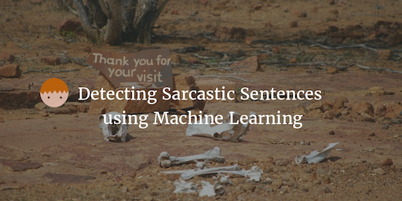

--- 
layout: post 
title:  Sarcasm Detection with Machine Learning in Spark
author: Lewis Gavin 
comments: true 
tags: 
- datascience 
- machinelearning
- spark 
---

## Intro to the Approach

This post is inspired by a [site](http://www.thesarcasmdetector.com/about/) I found whilst searching for a way to detect sarcasm within sentences. As humans we sometimes struggle detecting sarcasm when we have a lot more contextual information available to us. People are emotive when they speak, they use certain tones and these traits can help us understand when someone is being sarcastic. However we don't always catch it! So how the hell could a computer detect this, when all it has is text.

Well one way is to Machine Learning. I wondered if I could set up a machine learning model that could accurately predict sarcasm (or accurately enough for it to be effective). This search led me to the above link site where the author Mathieu Cliche cleverly came up with the idea of using tweets as the training set.

As with any machine learning algorithm, its level of accuracy is only as good as the training data it's provided. Create a large catalog of sarcastic sentences could be rather challenging. However searching for tweets that contain the hastag #sarcasm or #sarcastic would provide me with a vast amount of training data (providing a good percentage of those tweets are actually sarcstic).

Using that approach as the basis, I developed a Spark application using the MlLib api that would use the Naive Bayes classifier to detect sarcasm in sentences - This post will cover the basics and I will be expanding on this next time to utilise sarcastic tweets to train my model!

## Setting up the Naive Bayes algorithm

First things first you're going to require the Spark MlLib dependency within your project. This contains the functionality to not only perform Naive Bayes classification, but to also create a vector from a list of words (something the Naive Bayes algorithm requires).

Once thats all set up we need to perform the following steps:

Create two test files (CSV's), one for training and the other for test data. Fill it with 6 rows (I'll show an example later). The file should have 2 "columns", the first for the label(I used 1 for a sarcastic row and 0 for a non sarcastic row) and the second for the sentence.

Create two data frames: each with 2 columns "label" and "text" - one data frame for the training data, the other for the test data.

~~~scala

/* Read in our csv, split on comma and create a tuple. 
The first element being the label, the second being an array of each individual word. 
Convert to Data Frame for use later
*/
val trainingDF = sqlContext.createDataFrame(sc.textFile(args(0)).map(input => input.split(",")).map(x => (x(0),x(1).split(" ")))).toDF("label","text")

val nonTrainedDF = sqlContext.createDataFrame(sc.textFile(args(1)).map(input => input.split(",")).map(x => (x(0),x(1).split(" ")))).toDF("label","text")

~~~

For each dataframe, convert the **text** column to a vector using the Word2Vec library provided by MlLib. This is so that we have a consistant representation of our sentences in numeric format. This data can then be used by the algorithm to build a model allowing it to predict/guess whether a similar vector is also sarcastic (or not).

~~~scala
//create a new vector of size 4
val word2Vec = new Word2Vec()
      .setInputCol("text")
      .setOutputCol("result")
      .setVectorSize(4)
      .setMinCount(0)
//push our traning data frame into a vector of size 4
val training = word2Vec.fit(trainingDF).transform(trainingDF) 
//do the same for our non training data   
val nonTraining  = word2Vec.fit(nonTrainedDF).transform(nonTrainedDF)
~~~

Now create a `LabeledPoint` from the label and vector, and ensure any negative values returned by Word2Vec are converted to their absolute value. This is because the Naive Bayes functions do not support negative numbers.

~~~scala
// create a labelled point from the label and vector (each number in the vector needs to be converted to its absolute value as Naive Bayes doesnt accept negatives)l
val trainingData = training.map { line =>
  LabeledPoint(line.getAs[String]("label").toDouble, Vectors.dense(line.getAs[org.apache.spark.mllib.linalg.Vector]("result").toDense.toArray.map(a => Math.abs(a))))
}
val nonTrainData = nonTraining.map { line =>
  LabeledPoint(line.getAs[String]("label").toDouble, Vectors.dense(line.getAs[org.apache.spark.mllib.linalg.Vector]("result").toDense.toArray.map(a => Math.abs(a))))
}

~~~

The exciting part! **Build our model** using the Naive Bayes *train* function. We will pass it our `trainingData` of `LabeledPoint`s we created previously. This will now build a model that can be used to classify new sentences - that the model has never seen before - as sarcastic or not sarcastic by seeing if the new sentence (when converted to a vector) is more similar to sarcastic vectors, or non sarcastic vectors.

~~~scala
val model = NaiveBayes.train(trainingData, lambda = 1.0, modelType = "multinomial")
~~~

Once the model is built, we can then use this model to predict our `nonTrainData`. We want to create a tuple containing the predicted value, and the original label that we gave the data so we can see how accurate it performed.

~~~scala
//create tuples containing the models predicted value and our original labelled value
val predictionAndLabel = nonTrainData.map(p => (model.predict(p.features), p.label))
//calculate percentage predicted correctly
val accuracy = 1.0 * predictionAndLabel.filter(x => x._1 == x._2).count() / nonTrainData.count()

//print out the predictions with their original labels
predictionAndLabel.collect().foreach(println)
//print out the accuracy (the closer 1 the better as 1 == 100%)
println("Accuracy " + accuracy)
~~~

You can also save this model in a similar way to saving data normally with Spark. It can be saved to Hadoop or the local file system. When you (or anyone else) wishes to then predict the level of sarcasm within a sentence, they can simply write a Spark application that loads your model and can then use it as shown previously.
~~~scala
// Save model to hdfs
model.save(sc, "some/hdfs/location/SarcasmModel")

// reload the model to be used for prediction (in a seperate application for example)
val sarcasmModel = NaiveBayesModel.load(sc, "some/hdfs/location/SarcasmModel")
~~~

## Testing it on sample data

To put all of this together, it would be good if we could test it on a small, trivial data set to ensure that it works. Once we've done that we can start to think about how to scale it to include twitter.

This will require 2 data files to be created. A training set, and a sample set to test our trained model.

My training file looks something like the following. The numbers at the start dictate whether or not the sentence is sarcastic or not. 1 = sarcastic, 0 = not sarcastic.

~~~
1, "can't believe you've done it again just marvelous"
1, "you should all check out the new updates to the app if you really want to be wow'd. Useless!"
1, "don't you just hate sarcasm - nor me!"
1, "I wonder if birds know they can fly"
1, "being arrested is one of the best things ever - dont you think?"
0, "this is just a normal sentence no really"
0, "Love the new updates to the app really improved the service"
0, "Just used the app and it was great"
0, "had a good day writing blog posts"
0, "if you are reading this its too late"

~~~

My sample data to start off with was very small. Again I use a label but this label is just for reference, so I can compare with the predicted output to know whether or not the prediction was correct. I'm testing using one sarcastic and one non-sarcastic sentence. Although I would recommend using a larger data set for more accurate testing. This is just to prove the concept.

~~~
1, "really rate that new application... not!"
0, "Didnt like the new app was not very helpful"
~~~

Now that it's all set up, we can go ahead and run the code

~~~bash
spark-submit --master local[4] --class com.gav.SarcasmDetector SarcasmDetector-1.0.jar file:///home/documents/training.txt file:///home/documents/sample.txt
~~~

As you can see from the results below we got a 100% accuray rate. It predicted our first sentence to be sarcastic, and our second to be non-sarcastic. Again, this could have been pure look due to the size and quality of the training data and the small test sample we used. However it at least proves we are on the right lines and we have some working code.

~~~
16/09/14 15:08:19 INFO scheduler.TaskSchedulerImpl: Removed TaskSet 14.0, whose tasks have all completed, from pool 
16/09/14 15:08:19 INFO scheduler.DAGScheduler: ResultStage 14 (collect at SarcasmDetector.scala:89) finished in 0.043 s
16/09/14 15:08:19 INFO scheduler.DAGScheduler: Job 7 finished: collect at SarcasmDetector.scala:89, took 0.090898 s
(1.0,1.0)
(0.0,0.0)
Accuracy 1.0
~~~

## Next Time

The next challenge now is to improve on the training data. The way I plan to do this is to use twitter data and use tweets that contain `#sarcasm` as my sarcastic training set. This will give me a huge amount of training resources that should hopefully improve the accuracy of the model.

Stay tuned for next weeks post where I will look at building in this twitter integration. I hope this was a useful intro into Naive Bayes classification to try and solve a very difficult problem.
