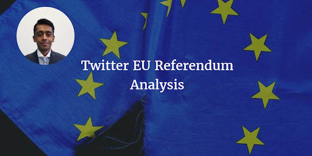

--- 
layout: post 
title:  Twitter EU Referendum Analysis
author: Vishal Jhaveri
comments: true 
social: linkedin.com/in/vishal-jhaveri-b13089109
tags: 
- spark 
- datascience
- bigdata 
---

## Objective

To predict the EU referendum

## Hypothesis 

Determine whether social media is a viable forum for predicting the EU referendum

## Background

The EU referendum has been one of the most discussed and controversial topics in recent years. It has been over 40 years since Britain first joined the European Economic Community (as the EU was known then) when Prime Minister Edward Heath was in charge. Two years later, Britain had a referendum to decide whether to leave or stay in the EEC, 66% voted to stay.

Now, 41 years later - we have another referendum - but this time we have access to data that was unavailable in 1975. Social media right now is used by around 59% of the population of the UK which is around 38 million people1. A few of the social networks like Facebook and Twitter have APIs that can be used to analyse what people are talking about. So this seemed like the right time to make use of social media to determine whether it is a viable source to predict the result of the EU referendum.

To read more please click on the link below:

[Twitter EU Referendum Full Analysis](http://www.capgemini.com/blog/insights-data-blog/2016/09/twitter-eu-referendum-analysis-by-vishal-jhaveri)

