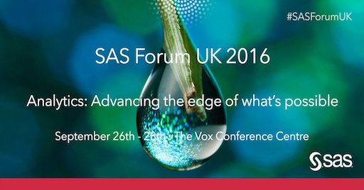
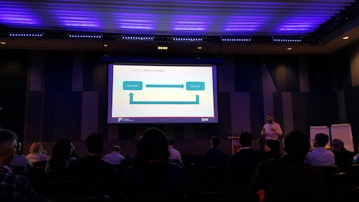

--- 
layout: post 
title:  SAS Forum UK The Launch of Viya
author: Lewis Gavin 
comments: true 
tags: 
- conference 
- machinelearning
- sas 
---

*Image taken from [twitter](https://pbs.twimg.com/media/CtckOlzXYAkiwCz.jpg:large)*

This post will share my thoughts from the UK SAS Forum!

The day opened with an introduction into Viya and its capabilities before moving onto SAS customers discussing use cases. In the afternoon the conference hosted a number of 30 minute sessions across a number of streams including customer stories, SAS hosted talks and Technical talks. 

This post will share my thoughts on each of the sessions I attended as a Data Engineer and budding Data Scientist that has heard of, but never used SAS. I will be focusing on the capabilities that SAS tools can leverage and what they mean to Data Engineers and Scientists.

## Keynote: SAS Viya - Hugo D'Ulisse

The event comes a few days after the first release of SAS Viya: The new SAS open analytics platform. Viya has been the talk of the conference as it promotes not only a new platform but also a new direction for SAS. The main point being stressed around Viya is that it is **open**. This means that analytics capabilities will be opened up through API's that can be used in Python and Java. **Open** also refers to the platforms that Viya can be deployed on, including **Cloud based** infrastructures. 

*Image taken from Twitter*

## Keynote: Royal Bank of Scotland Use Case - Paul Hollands

Paul Hollands from RBS gave a very impressive presentation named "Are your wheels rounder than mine?" reffering to how well RBS have used SAS (the same tools that everyone else has access to) to gain great insight. What he was getting at was that the way you use the tools is just as important as the tools themselves.

There was a live demo that focussed on a use case where RBS were trying to decide how many offices they needed based on where their employees live. By using SAS Visual Analytics (that they rebranded as Genie) they could plot on a map where their employees live and use SAS to flex the number of office buildings and in real time show how that affects the number of employees that live within 40 miles of an office.

*Image taken from Twitter*

RBS have also built something named Next Best Action. This tried to solve the problem of tracking customers across all channels and also how to resolve customer complaints. By tracking customer events before a complaint was made, the complaint itself and the resolution method, they could then use a feedback loop to learn and use the insights from this to instigate better actions in the future, or avoid the complaint altogether.

## Customer Stories: Nationwide - Katy Cook

Nationwide use Business Objects, Qlikview and SAS for their analytics and reporting. They hold 16TB of data and are currently using v9.2 of SAS. They have to process 380 million records a day and have 350 users and 650 data consumers on their "SASO" server (high performance SAS server).

They have used SAS for many years moving through the ecosystem however the majority of the talk was around business processes. The key points to take away are that they are also looking at how to better put the customer first and quicker understand their intentions to improve the customer experience.

Their development teams also take 30 minutes every 2 weeks to do some "housekeeping". This includes things like finishing up documentation, code refactoring or task management - a really good idea!

## Machine Learning in SAS - John Spooner

Yes - Machine Learning is possible in SAS. They have rebranded these capabilities in SAS Viya as Visual Data Mining and Machine Learning (VDMML). The way they defined Machine Learnin was that its a process that looks to convert raw data into decisions. The idea being that you train a machine with no human interaction where possible and re-inforce the learning to improve the accuracy of the results.

VDMML supports both structured and unstructured data. By unstructured data this means not only text, but images, sound or videos too. The 3 mains areas that are covered are Data Prep, Machine Learning Algorithms and Model Scoring (how do you deploy your model). 

As I mentioned earlier, SAS can now be deployed on a number of different infrastructures: including Hadoop. Machine Learning algorithms are naturally computationally heavy so being able to distribute this processing on a big data platform like Hadoop is very useful - similar to the concept applied by Spark MLLib. This makes SAS desireable for Data Scientists as they can now run their models on large data sets very quickly and get to analysing the results faster.

## SAS on Hadoop 

As I just mentioned, SAS can now be deployed on a Hadoop cluster. I was curious as to how this would work and how it performs. There are 3 ways to run SAS code in conjunction with Hadoop:

1. From Hadoop - bring the data out of Hadoop and process it on a SAS server. This works for small amounts of data and testing but wouldn't be optimal for using the power of the cluster for large computations.
2. Move SAS workload into Hadoop to the data using Map Reduce and Spark - this would convert SAS code into Map Reduce or Spark code and run that on the cluster.
3. Move SAS Application to Hadoop through Yarn - this requires SAS kernals to be running on Hadoop data nodes that can accept and run SAS code directly on the cluster and obtain its resources via YARN.

## Cloud Directions - David Annis

One of the main focus points of the conference was around the new Cloud direction. SAS are entering the market to give you all the benefits you would expect from a Cloud platform. There will be a number of different deployment methods with the new SAS Viya platform including having the whole cloud platform and infrastructure hosted by SAS or using your own cloud vendor and deploying Viya on top of that.

The main challenges will be around their licensing model. Most cloud vendors follow the pay for what you use model. SAS want to follow this however traditionally this isn't how they license their products. It will be interesting to see how they overcome this.

## Number Crush with Hannah Fry

The final session of the day was presented by Hannah Fry who has done a number of shows for the **BBC**. Hannah talked through a number of interesting use cases for data and analytics including figuring out where mass murderers live in relation to the location of their crimes and calculating pain points in the London travel network. 

*Image taken from Twitter*

The biggest thing I took away from this was probably the opposite of what SAS would have wanted. Most of the day was positioned around automating data science capabilities and abstracting the complexities that come along with analytics. However Hannah's experiments and findings proved that regardless of how good the tools are, people that have the right brains to think analytically are still going to be required in order to answer the really interesting and difficult questions.
