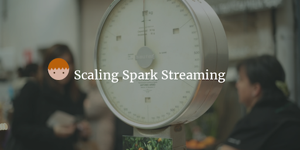

--- 
layout: post 
title:  Scaling Spark Streaming
author: Lewis Gavin 
comments: true 
tags: 
- bigdata 
- streaming
- spark 
---

In previous posts I have looked at [Spark Streaming](http://www.lewisgavin.co.uk/Spark-Streaming/) and [improving the performance of Spark applications](http://www.lewisgavin.co.uk/Spark-Performance/).

This post is going to delve deeper into scaling Spark streaming applications to ensure higher throughput of data.

## Standalone Spark Streaming

Without repeating too much of what was covered in my original [Spark Streaming](http://www.lewisgavin.co.uk/Spark-Streaming/) post, Spark will recieve serialized data over the network. This data will be sent to a reciever on a particular node where it will be deserialized into RDD's to be stored in Spark's memory. These RDD's are then split and sent to other worker nodes where transformations are executed in parallel.

This distribution across workers is done dynamically meaning that *work* is evenly distributed based on the current workload of each worker. For example if you are recieving data in 5 second batches. For 2 minutes you only recieve really small amounts of data then you start to recieve huge amounts of data for a minute or so before returning to smaller data amounts. 

In traditional streaming applications if data is partitioned based on size and sent to different nodes statically, the 1 minute of large data sets could cause a large bottleneck on the servers that process the bigger loads.

In Spark this wouldn't be a problem, as data is distributed **dynamically**. Data is sent to nodes that are capable of processing at that point in time.

*Image taken from [Databricks](https://databricks.com/blog/2015/07/30/diving-into-apache-spark-streamings-execution-model.html)*

This standalone model can achieve througput of hundres of thousands of records, per node, per second. Which in itself is impressive seeing as along with this you get resiliance and a whole host of compatible Spark libraries.

## Better Parellelization for Higher Throughput

If you require more than what you get out of the box from Spark, then you could integrate Spark with Apache Kafka. This would support around half a million records per node per second, and seeing as it can pretty much scale linearly, this will inevitably give you very high throughput.

To reduce the processing time, which can be one of the bigger bottlenecks, you can distribute this out to multiple nodes. Rather than have a single node receiving the data and distributing the pre-processed RDD's across a cluster - you set up multiple DStreams instead and attach them to Kafka partitions. This will allow multiple nodes to receive, deserialize and process data in parallel.

If you then need to bring the results of each node back together you can use the inbuilt union function to union all the streams together.

## Tuning the Batch and Block Size

Apart from scaling sideways to boost throughput, tweaking the batch size can also have a good effect. The default block interval is 200ms. So 200ms worth of streamed data is stored in a block in Spark memory. Similar to cached RDD's this is managd by the block manager.

If you have a block interval of 200ms and a batch interval of 2 seconds this would result in around 10 operations needed to process the data (this is calculated as batch interval divided by block interval). As you can see flexing the block interval to suit the batch can reduce the overhead of the number of operations required to process each batch. 

*Image taken from *

For example changing the batch interval - using the spark.streaming.blockInterval paramter - to 500ms would mean only 4 operations are required to process each batch of data, saving you over half of the overhead. However bear in mind that if this is too large then that will prevent the number of blocks created, and therefore partitions, ultimately leading to inefficient parallelisation.

