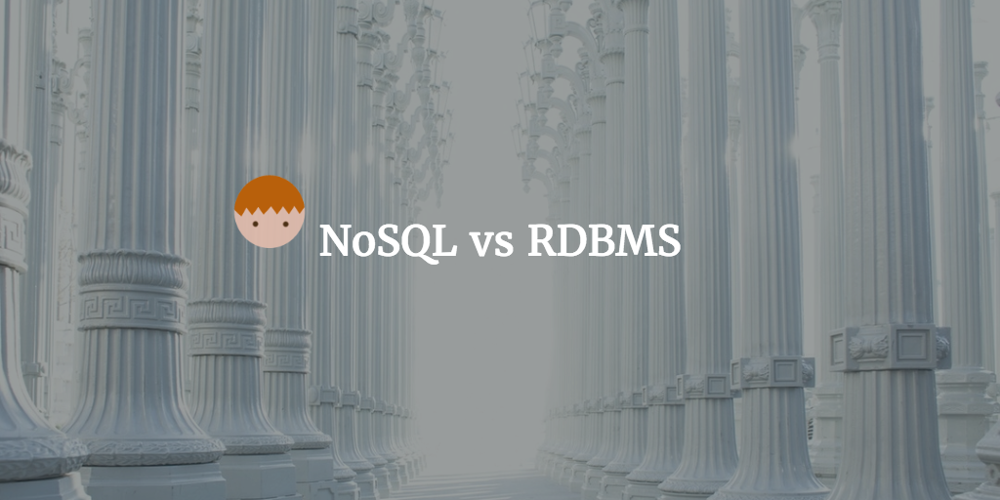

--- 
layout: post 
title:  NoSQL vs RDBMS 
author: Lewis Gavin 
comments: true 
tags: 
- bigdata 
- nosql
- database 
---

This post will be looking into the differences and benefits of NoSQL databases in comparison to traditional databases. After exploring this a little in my [previous post on Apache HBase](http://www.lewisgavin.co.uk/HBase-Intro) I thought it was worth a full post.

## Some Definitions

NoSQL usually stands for *Not Only SQL* and refers to storing and viewing data that is stored without the concept of standard tables and relations - SQL usually IS NOT used to access or manipulate the data.

RDBMS stands for Relation Database Management System and refers to the relational data storage and retrieval system where standard SQL is used for access.

## Where did NoSQL come from?

After a little digging it seems the hype for NoSQL rose from Googles BigTable. They were after a resilient, distributed and flexible data storage mechanism that traditional systems couldn't give them - so they came up with BigTable that is built on top of the Google File System (GFS). 

As with many things, Google were pioneers and this same concept was embraced by many others opening the way to many other NoSQL style data stores. Once the benefits were clear, there was no looking back. So what are the benefits?

## Benefits of NoSQL

NoSQL databases work well when you have something that wouldn't easily be stored in a standard table - for example documents or semi-structured data. Large and unstructured data has become more popular due to social networks and the rise of artificial intelligence - due to the human language being a great learning resource for machines. 

**Image taken from [Microsoft Azure](https://azure.microsoft.com/en-us/documentation/articles/documentdb-nosql-vs-sql/)**

NoSQL databases have predominantly been big due to uprise in distributed computing and companies not wanting downtime. Traditionally you were limited to Terabites of data for reasonable costs, but with distributed technologies and file systems (including Hadoop) becoming more accessible, storing Petabites of data is required and horizontal scaling of your data storage mechanism is important. 

As I mentioned previously, companies also want to remove downtime. Relational databases could require downtime for things like updating a schema, not very useful especially if you are working on an agile project and features are being added regularly. NoSQL databases allow for **dynamic schemas** and because they work across a cluster, if a node needs to be taken down - the data should be available on other nodes preventing downtime.

## Types of NoSQL databases

There are various types of nosql databases including document, graph, key value and wide column.

**Image taken from [Slideshare](http://www.slideshare.net/spf13/nosql-databases-and-managing-big-data)**

### Document

Data is stored in Key-Value pairs with the Value being a complex data structure that is classed as a document - these documents themselves can contain even more complex structures.

Examples: Elasticsearch, Solr

### Graph

Graph databases are used to store network and relationship data. Each data item is a node, and each node can have a relationship to another node. Both nodes and relationships can store properties. This is extremely powerful when trying to map out networks for things like social networks, detecting fraud of producing recommendation engines.

Examples: Neo4j

### Key-Value 

Data again is stored in Key-Value pairs but the value is much simpler than the complex types common in Document data stores. 

Examples: Riak, BerkeleyDB

### Wide-Column

[HBase](http://www.lewisgavin.co.uk/HBase-Intro) is an example of a Wide-Column database. All data that relates to something is stored on a single row. Columns are as wide as you like and they are designed for queries over wider sets of data. Usually have no concept of a join as the data is already pre-joined and stored together.

Examples: HBase, Cassandra

