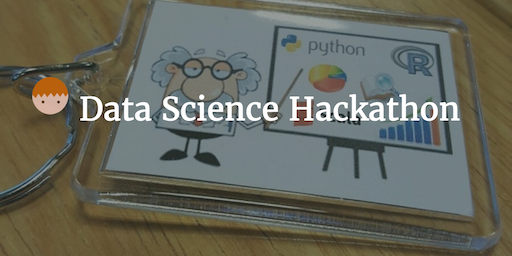

--- 
layout: post 
title:  Data Science Hackathon
author: Lewis Gavin 
comments: true 
tags: 
- datascience 
- hadoop
- R 
---

To spread the recent data science techniques used in certain projects at work, we decided to host our first Hackathon! The idea was to take a day off from the usual day job so everyone had the opportunity to learn something new and have some fun, in a safe environment.

The theme of the Hackathon was around Text Mining, as this is an interesting area that requires no background in analytics, stats or maths to get involved.

## The Setup

People signed up in pairs and were provided with overview sessions to attend in weeks prior to the event. These sessions went over the basics of Text Mining. Hints were provided around the dataset and techniques but the actual "exam question" wasn't released until the day.

A Slack channel was set up to share information and updates with all involved and was used to provide support throughout the day.

There were no constraints on the technology that could be used, however there was a pre-packaged virtual machine to help containing Python and RStudio - plus a Cloudera cluster with Spark, Hive and Impala.

## The Dataset and Exam question

The dataset provided was the [Amazon Fine Food Reviews dataset from Kaggle](https://www.kaggle.com/snap/amazon-fine-food-reviews). This dataset contained around half a million rows of reviews on food items sold on Amazon. This particular dataset was chosen due to the large amounts of free text available - perfect for Text Mining! Not only that, but the context was food based, meaning it was a neutral dataset - easy for anyone to understand.

By providing half a million rows text of data, this gave the contestants the opportunity to see how long calculations can take on large datasets - proving the importance of sampling when performing exploratory analysis.

The exam question for the day was purposefully kept broad - "Find some insights in the data using Text Mining Techniques". This gave people the opportunity to discover and play as they pleased, encouraging learning of a whole bunch of different techniques. There were some starter questions to help get the ball rolling including: *What were the most common phrases (bi/tri-grams)?* and *what sentiment can be derived from reviews on certain products?*

Contestants were asked to produce a "one pager" outlining their Hypotheses, Method, Visualizations & Insights and What they learnt. These would be shared to each other at the end of the day and voted on by all participants to produce 2 winners.

## Outcomes

Naturally, due to the nature of Text Mining and the lack of simple visuals to present textual findings - nearly every team produced a **wordcloud**. However most teams backed up their wordclouds with other interesting findings.

Most teams used R and produced Document-Term Frequency matrices to do the bulk of their analysis however most teams found (Due to RStudio only being able to run on a single core) that they were unable to process the whole dataset. A small number of teams used Spark and due to it being able to process in parallel and in memory, could perform their analysis on the whole data set. The findings were only slightly different but demonstrated limitations of certain tools.

Some teams chose to visualise their findings using R plots, others exported their data and used Tableau. One team looked at modeling the relationships between review submitters and products using Neo4J. Their hope was to be able to demonstrate common products between individuals to aid with recommendations. 

Overall, the day was a huge success and greatly received. People really enjoyed the opportunity to do something a little different and there wasn't a single team that could say they didn't learn something new. Hackathons are a great way to get people interacting collaboratively and really help introduce new topics in an interesting way. I hope to be a part of more in the future!

