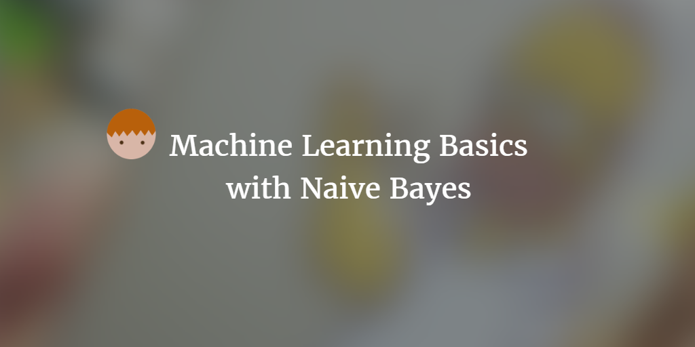
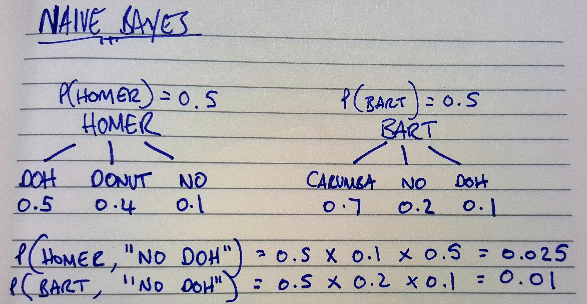
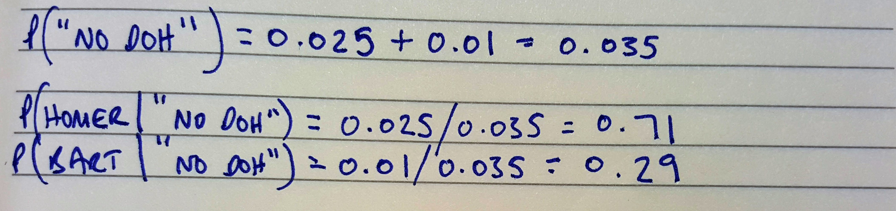

--- 
layout: post 
title:  Machine Learning Basics with Naive Bayes
author: Lewis Gavin 
comments: true 
tags: 
- data science
- machine learning
---

After researching and looking into the different algorithms associated with Machine Learning, I've found that there is an abundance of great material showing you how to use certain algorithms in a specific language. However what's usually missing is the simple mathematical explaination of how the algorithm works. In all cases this may not be possible without a strong mathematical background, but for some I know I would definitely find it useful.

This post requires just basic mathematics knowledge and an interst in data science and machine learning. I will be talking about Naive Bayes as a classifier and explaining in simple terms how it works and when you might use it.

## Machine Learning

One of the first things to understand about Machine Learning is that at it's most basic abstraction, it is a set of **algorithms** that are **data driven** in order to provide answers. This means that the data itself is just as important as the underlying algorithm. You can split Machine Learning algorithms into two categories: **Supervised** and **Unsupervised**. 

Supervised learning requires a **labelled** data set. This means each data item and all its **features** that you provide to train the algorithm are labelled with the correct answer. The algorithm then uses this combo of data item and outcome/answer in order to "learn" what sorts of things dictate a certain answer. When provided with data it has never seen before, that isn't labelled, this trained model can then **predict** the answer based on what it has seen before.

Unsupervised learning is the opposite. It does not know upfront what it is looking for so it has to figure out itself how to cluster the features to learn and reach an outcome.

## Naive Bayes

So where does Naive Bayes fit into all this? 

Naive Bayes is a **Supervised** machine learning algorithm. It is commonly used with text based data sets in order to learn and understand something about text. For example, given a set of emails and people that wrote them, Naive Bayes can be used to build a model to understand the writing styles of each email author. Once trained, it can then be given an email without being told who wrote it. It can then predict who wrote it based on what it was taught. As you can see, the training data is vital to the success of the model.

*Image taken from [Simafore.com](http://www.simafore.com/blog/bid/107271/How-to-apply-and-interpret-Naive-Bayes-classification-in-RapidMiner)*

## How does it work?

To walk through how it work's, I am going to use a simple Text Classification example. Using Homer and Bart Simpson and words they frequently use, I will go explain how the Naive Bayes algorithm could predict who said a certain phrase.

Let's walk through what this is showing.

1. The first line is showing the distribution, so how much data do we have for Homer vs Bart - as you can see here its a 50/50 split.

2. For both Homer and Bart there is then 3 words each that they may use, and beneath each word a frequency weighting: how often is the word used by the person. e.g. Homer users the word 'DOH' 50% of the time, 'Donut' 40% and 'No' the final 10% - obviously their vocab is much richer, but this small sample is enough to explain the concepts.

3. Based on what we know and given the statement "No DOH" - We now need to figure out the probability of each person saying that phrase. This is calculated in the final two lines of the above diagram.

As a keen observer, you'll notice these probabilities don't add up to 1 (100%). In order to fix this we need to accumulate the two probabilities to give us the probability of the statement "No DOH" regardless of who said it. We can then calculate the **Posterior Probability** for both Homer and Bart by dividing their original probability by the accumulated one as shown below.

As you can see, we now get two probabilities that when added together make 100%. We can also see that theres a 71% chance that Homer said this phrase. As you can see, the order or word combination isn't taken into account, only each individual word and it's frequency. This is the reason behind the name "Naive" - because each **feature** (in our case word) is being treated indepdendently of the others.

## An Example Implementation in Python

I wrote a post a short while ago on using Machine Learning to detect sarcasm within Tweets that gives an example of this. However I wanted to use a simpler example based on the Simpsons example I shown above.

I've taken the [Kaggle Simpsons data set](https://www.kaggle.com/wcukierski/the-simpsons-by-the-data) and used the script and character data to try and train a machine learning model, using Naive Bayes, to predict whether it was Homer or Bart that said a certain phrase.

For brevity I will just walk you through the basic implementation of the Naive Bayes classification and my results. To get the main bulk of the code that would help you vectorise the phrases and preprare them into a training and test data set, see the [Udacity Intro to Machine Learning Github repo](https://github.com/udacity/ud120-projects) and take a look at their Naive Bayes examples.

Firstly, filter and split your Simpsons data up - you can do this manually - to get a file that contains one id on every line that is either a Bart id (8) or a Homer id (2). Make another file and put the normalised text for this filtered data on each line (make sure its in the same order as the id's so row 1's id matches row 1's text etc...).

Now for the fun part. Write yourself a simple python application to Vectorise and prepare these data sets ready for learning. You can use the [Udacity example](https://github.com/udacity/ud120-projects/blob/master/tools/email_preprocess.py) and tweak that. Once done you can fit this data into a Naive Bayes model.

~~~python
import sys
from simpsons_script_preprocess import preprocess

### obtain your preprocessed data from your preprocessor application
features_train, features_test, labels_train, labels_test = preprocess()

### Build you Naive Bayes training model
from sklearn.naive_bayes import GaussianNB
clf = GaussianNB()
clf.fit(features_train, labels_train)

### Print out the accuracy using the score function
print "Naive Bayes accuracy:", clf.score(features_test, labels_test)
~~~

~~~bash
Naive Bayes accuracy: 0.69784868262
~~~

With just using the two id's within the data set and no tweaking of the model, we managed to get 70%! It's not bad but it's not perfect either - anything over 80% I would be happy with but it's a starting point. You can now add further Bart and Homer id's from the data set (as there were multiple for their different characters) and start tweaking parameters to see if you can improve the accuracy.

