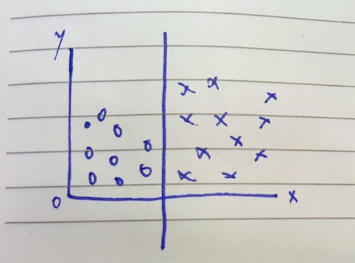

--- 
layout: post 
title:  Improving on Naive Bayes with Support Vector Machines
author: Lewis Gavin 
comments: true 
tags: 
- data science
- machine learning
---

Last weeks post was a [Machine Learning Intro for everyone](http://www.lewisgavin.co.uk/Machine-Learning-Basics) delving into the basics of Naive Bayes using Simpsons data. This week I am going to build on this to try and improve the accuracy using Support Vector Machines.

## Support Vector Machines

An SVM is another example of a Supervised Learning algorithm. SVM's look to find a hyperplane between two classes. Essentially tring to find a line that fits between two classes. 

A good line is dependant on a number of things. One of those is the margin. The margin is the distance between the closest point and the line, the larger this is, the better the split and the better the SVM should be.

You might not always get a perfect line, where all elements of each class lie perfectly on each side of the line. Those points that don't are called outliers. When dealing with an outlier, the SVM will just take it's best guess and depending on how you tweak the parameters (like I did for Naive Bayes). 

## Non Linear Patterns - Kernels

In the above examples, the data points can be simply split on a linear plane. Not all data sets can be split linearly, however they can still be split. In order to achieve this an SVM uses something called a Kernel trick. 

At the minute, the way these work is above my Mathematical knowledge. However the idea is that they take your points plotted on an x,y dimension and apply them to a much larger higher dimension space in order for a linear pattern to be established. Once this hyperplane is found you can then transpose the whole thing back to the original dimension and you have a Non Linear pattern that splits the data.

![Non Linear SVM Kernel Trick] (../images/nonlinear_svm.jpg)

From the above image you can see that the data on the left is non linearly separable, it would involve drawing an arc around the circles to fairly separate them from crosses. To do this you apply a kernel trick, in this case taking x,y and mapping it to x^2,y^2 and voila! It's now linearly separable.

The Python sklearn library for SVM's allows you to choose between a number of different Kernels when constructing an SVM, with the default being linear.

## Python Example

So what does this mean for our Homer and Bart text classification problem?

Well we code up our SVM to use both Linear and an RBF kernel and see what we notice in the results. 

~~~python
from sklearn.svm import SVC
clf = SVC(kernel='linear')

# reduce the size of the data set for speed
features_train = features_train[:len(features_train)/80] 
labels_train = labels_train[:len(labels_train)/80] 
clf.fit(features_train, labels_train)

print "SVM Accuracy:", clf.score(features_test, labels_test)
~~~

Output:
~~~shell
SVM Accuracy: 0.703166545806
~~~

As you can see, using only a very small sample of the data we get a slightly higher accuracy than Naive Bayes did in the previous post.

However when changing the Kernel to 'rbf' the accuracy (for the same sample dataset) reduces!

~~~shell
SVM Accuracy: 0.685762629925
~~~

This is why it is important to try out different algorithms and parameters before deciding on your utlimate winner.

It is also important to note that an SVM will **run much slower** than Naive Bayes - hence why I only used a sample of the data set. This is something else to bear in mind, especially when classifying large amounts of text. Naive Bayes seems more suited to this task as you don't lose much accuracy and have the benefits of a quicker running time.

