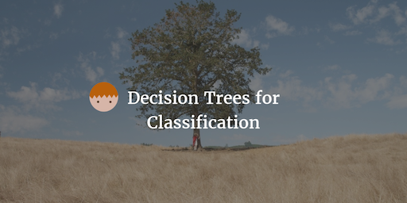

--- 
layout: post 
title:  Decision Trees for Classification
author: Lewis Gavin 
comments: true 
tags: 
- data science
- machine learning
---

The last post in the Machine Learning algorithm frenzy that I'm currently on was based on [Support Vector Machines](http://www.lewisgavin.co.uk/Machine-Learning-SVM). This post is going to look at another classification algorithm called a Decision Tree and again see if this can improve on our classification problem of predicting whether lines from Simpson's episodes are said by Bart or Homer.

## Decision Trees

Again, a **Decision Tree** is a supervised learning algorithm that can be used to classify data based on a model it has built on training data. Like the other models, it tries to split data into two or more sets but the most significant variable that creates the best split is calculated by the algorithm.

Using the Simpsons as an example, using the variables height, weight and shirt colour. To distinguish between Homer and Bart from a set of images the decision tree would split the data on each of them and choose which performs best. Now we know that Bart and Homer are **normally** different in each of these variables. However "Teenage Bart" may match Homer in a small number of cases in height. Bart may also wear white t-shirts in a very small number of episodes. However lets say (it may or may not be true) that Bart is never depicted as the same weight as Homer in any episodes - then weight would be the chosen split variable as for Bart and Homer weight is **never** the same.

*Image taken from [Slideshare](http://www.slideshare.net/marinasantini1/lecture02-machine-learning)*

Now, I hear you say that it's rare that this is ever the case! In the real world, finding a really true split may not be possible. The next section will discuss how this is dealt with.

## Information Gain and Entropy

Entropy controls how a Decision Tree decides where to split the data. It's essentially a measure of impurity in a set of data. Using the above example, if all examples in a class are the same; e.g. all data points with a weight less than 70kg relate to Bart and all points greater than 70kg relate to Homer, then there is an **Entropy** of 0.

On the flip side, lets say there is an equal number of episodes where Bart and Homer wear white or orange shirts. 50 episodes where Bart wears white, and 50 where he wears orange, and the same for Homer. Then this data would have an Entropy of 1. Obviously there can be any differentiation between this scale.  

The algorithm would calculate the Entropy for each variable and the variable with the lowest Entropy will be the chosen variable for the decision tree split. The lower the Entropy the more accurate the prediction.

## Positives and Negatives

**Positives**

1. Really easy to understand even for those who have no prior machine learning or analytical knowledge
2. No constraint on which Data Types can be used
3. Can be useful for exploring a data set as it shows which variables are significant and which variables are connected.

**Negatives**

1. It is prone to overfitting, similar to the SVM's in the previous post so you need to take care and tweak the algorithms settings appropriately.

## Python Example

Let's see if we can improve on the accuracy score our Homer and Bart classification model vs the Naive Bayes and SVM implementations.

~~~python
from sklearn.tree import DecisionTreeClassifier
clf = DecisionTreeClassifier(criterion='entropy', max_features=250, max_depth=50)

# reduce the size of the data set for speed
features_train = features_train[:len(features_train)/20] 
labels_train = labels_train[:len(labels_train)/20] 
clf.fit(features_train, labels_train)

print "Decision Tree Accuracy:", clf.score(features_test, labels_test)
~~~

The output of this was:
~~~bash
Decision Tree Accuracy: 0.711385061639  
~~~

We can see that it is a definite improvement on our sample Simpsons data set however it did require some tweaking of the max_features and max_depth parameters to improve the score.