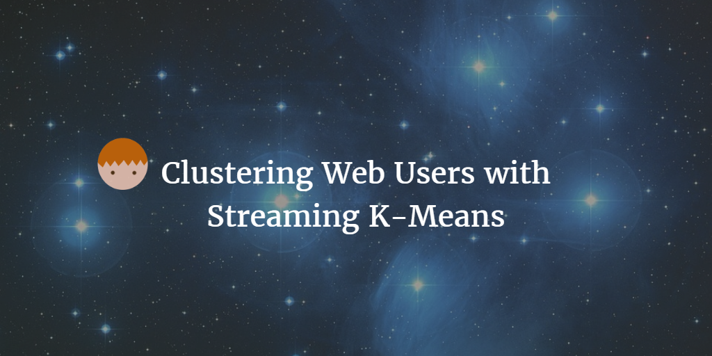

--- 
layout: post 
title:  Clustering Web Users with Streaming K-Means
author: Lewis Gavin 
comments: true 
tags: 
- data science
- machine learning
---

In recent machine learning posts, I've been concentrating on supervised learning algorithms such as Naive Bayes or SVM where you train a model with pre-classified data. This model is then used to predict outcomes on future data.

In this post I will be looking at an **Unsupervised** algorithm called K-Means. K-Means is used to cluster data together useful in a number of situations such as grouping people together. I will be using Spark streaming to show how you can stream events in from a website, run them through a K-Means algorithm and also update the model on the fly.

## K-Means

K-Means is an **unsupervised** learning algorithm that clusters data into groups. You pass the algorithm some data and specify how many groups you would like it to find. It will then try to split the data into groups. It trains itself using the variables you pass it and chooses itself the best way to cluster the data. This is the big difference between supervised and unsupervised algorithms.

It's easier to understand when you see it visually. Imagine each row of data you want to cluster as a set of Vector points. These points are then plotted on a graph. Once they are plotted you can then start to draw circles around clusters of points. These then become the groups and this is essentially what K-Means does for you.

*Image taken from [Mathworks.com](https://uk.mathworks.com/matlabcentral/fileexchange/26182-kernel-kmeans?requestedDomain=www.mathworks.com)*

In order for your data to be correclty plotted onto a graph, it of course needs to be converted into a set of vector points. For number data, this can be quite simple - however for textual data this becomes more difficult. Within Spark there is a library called Word2Vec that can help with this, or you could manually create an algoirthm yourself to convert the words to numbers and the numbers to Vectors.

## Streaming K-Kmeans

In some cases, when creating a model, you might want to keep it static. However in other cases, you will probably need to keep the model up to date. As new data arrives, retrain the model wiht new data to ensure it changes over time.

Let's say you want to take web logs from a webpage and use this data to group users together based on similar usage on your webpage. By doing this you can then serve content to users that people similiar to them also enjoy - hopefully improving their experience on your website. 

Over time though, peoples use of your website might change or your website itself may even be updated cause changes in behaviour. Therefore it is important to ensure your clustering model is being updated so you continue to accurately group your users together.

One way you can do this with K-Means is to use the [Spark Streaming K-Means](http://spark.apache.org/docs/latest/mllib-clustering.html#streaming-k-means) library. You get all the benefits of using Spark Streaming along with the capability to train your model and predict events in real time.

~~~scala

//set up a kafka stream so Spark can consume some event data
val messages = KafkaUtils.createDirectStream[String, String, StringDecoder, StringDecoder](ssc, kafkaParams, topicsSet)

//convert messages into vector points
val newEventData = Vectors.dense(messages._2)

//initialise a model - setK defines the number of clusters/groups to find
//setRandomCenters will define how many vector points per row will be used (number of variables)
val model = new StreamingKMeans().setK(3).setDecayFactor(1.0).setRandomCenters(10, 0.0)

//pass in a DStream of Vectors to train the model
model.trainOn(oldAndNewMessages)

//now predict which cluster your latest events belong to
model.predictOn(newEventData)

~~~

You can then kick off the streaming application to continuously bring in new new data and retrain the model to ensure that your clustering keeps up to date.

You may find that rebuilding your model everytime is too large of a overhead, especially if the data is large. So you might want to have a batch job that runs overnight to bring in all the historic data and build a new model with historic plus that days events.

