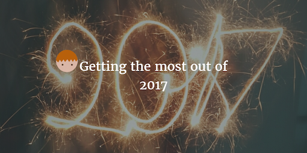

--- 
layout: post 
title:  Getting the most out of 2017
author: Lewis Gavin 
comments: true 
tags: 
- self improvement
- health
---

First things first, Happy new year! If you're anything like me, you've just enjoyed a nice break for the holidays and are ready to kill it in 2017.

After spending time reflecting on what I want out of 2017, I came up with a list of priorities for the year and the actions I could take in order to fulfill them. The main goal is to focus on **Enjoyment, Minimalism and Reduction**

This post will outline my goals and plan for the year. I will be adding subsequent posts to then follow my progress throughout the year and share any tips and tricks I have found useful.

## Goals for 2017

- Reduce and Minimise everything in my life.
- Live more, work less and get outdoors more often!
- See friends and family more frequently.
- Use my phone less to remove the distractions.
- Blog more about my lifestyle.
- Continue to enhance and configure my daily routine.

As you can see, all of these lead to a more enjoyable lifestyle with less being more! 

After compiling this list I then wanted to look at what things I really enjoy doing. If I can understand what these activities are, and then look at the activities that I find burdens, I can then try remove the burdens in order to have more time to do the more enjoyable activities.

Here are the two, very simple lists. 

### Things I enjoy doing

- Socialising
- Writing my blog
- Going for walks & being in relaxing outdoor places
- Meditating
- Exercising

### Things I feel are burdens

- Commute to work (~2h per day)
- Chores/Cleaning (1 day a week, usually a weekend)
- Food shopping (2-3 times per week)

### Improvement plan

Looking at the above burdens, there are only 3 real burdens that I feel consume time that should be free for me.

Looking at each in turn, I then began to note down potential solutions to reduce or remove them completely.

#### Commute and time spent at Work

- Find a new job closer to home
    + I really enjoy my job so this would have to be a last resort
- Change work hours
    + Could I work from home for a few days a week when feasible?
    + Being more disciplined to leave work at a reasonable time.

I decided that I would set a "home time" every day and stick to it to stop myself from overworking.

I will also be looking to work from home one or two days per week where I have no physical commitments such as meetings.

#### Chores/Cleaning

- Pay for a cleaner

This one was simple and something I should have looked into earlier. By paying for someone to come and clean the house will totally remove this from my burdens list.

#### Food Shopping

It seems like something so trivial, we all have to do it. However finding time to go food shopping is not always easy. It's an activity that usually consumes a large part of the weekend and I always find that I visit the supermarket a few times a week.

Again the solution to this problem was relatively simple.
- Use an online service and have the food delivered straight to my front door.

Similar to paying for a cleaner, this solution might end up costing a little more (although to begin with it seems fairly similar). However the amount it costs is negligible if it is going to allow me to spend that time enjoying other things.

## What's Next!

With two simple changes (removing chores and shopping from my weekend) I have now opened up my weekends and evenings to spend more time on the activities on my "Things I enjoy doing" list. With the improvement to my work schedule too, 2017 will undoubtedly be a fun and simple year.

For the rest of 2017 I will be mixing up this blog with lifestyle and self improvement posts, on top of the usual technology posts. Each week I will be bringing a new post breaking down the steps I will be taking to **Enjoy, Minimise and Reduce** so please stay tuned.

As a sneak peak - the first post will be looking at how I've changed my habits regarding my mobile phone and social networks.

