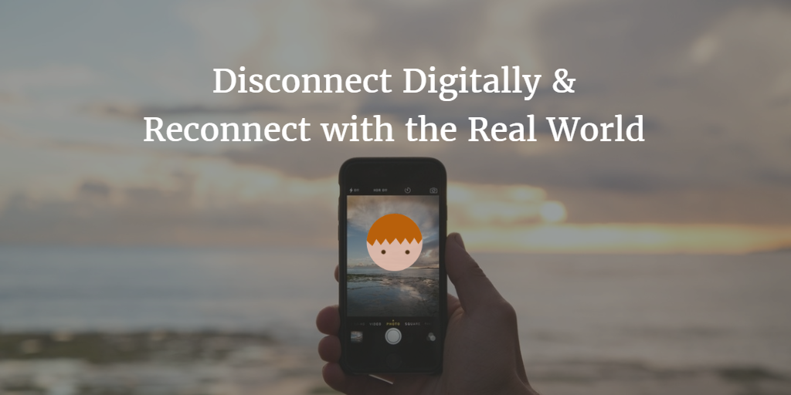
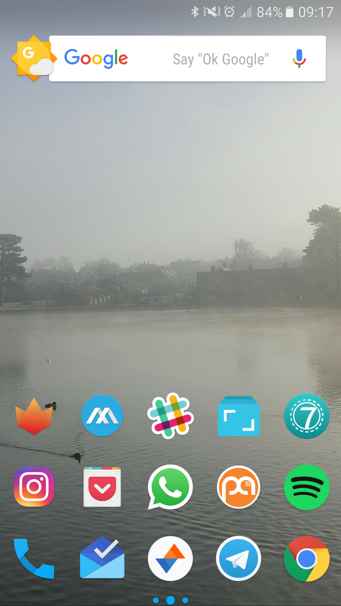

--- 
layout: post 
title:  Disconnect Digitally & Reconnect with the Real World!
author: Lewis Gavin 
comments: true 
tags: 
- self improvement
- health
---

In my [previous post](http://www.lewisgavin.co.uk/Goals-2017/)I shared my goals for 2017 and how I planned to focus on **Enjoyment, Minimalism and Reduction**. The starting point for me was to ensure I was present, in the real world in order to enjoy the activities I like doing. I also wanted to minimise as much as I could so that when I choose to do something, the activity had my full focus and attention.

I spent some time thinking about the different things that cause me to worry or that take my attention elsewhere. I found one of the biggest culprits was my smart phone. The constant vibrate and ping of notifications and obsession with not missing a thing online. This includes emails, social media notifications and browsing reddit or random article sites - anything that can first distract and then engage me.

Social media sites are designed - smartly - to be a continuous scroll of information that never never ends... so you scroll and scroll and scroll until seconds, minutes then hours pass by and you're left wishing you had time to do more productive things. This post will outline what I felt were negatives with the use of my smart phone, as well as the benefits and explain how I've tried to remove the negatives.

## Problem 1: So many notifications!

Throughout the course of the day everyones phone pings or buzzes due to a new notification and it's so difficult to not look. At the end of the day, that's what the notifications are for - to let you know there is something else that requires your attention. However in most cases, these notifications aren't really *urgent*. Phone calls are probably the top priority, everything else can wait and be responded to at a later time.

I wanted to give myself two set times in the day where I can spend 30 minutes or so to binge through all the notifications and then leave my phone alone. However I still want to be connected to the internet so I could use Spotify or Podcast Addict. 

**Solution - Removing the Stress**

I went into all of the social networking and email applications on my phone and altered my notification preferences. **I turned them all off**. This now means that even when connected to the internet I wont receive notifications. 

I now check my phone once in the morning when I arrive at work (usually with a coffee) as this is the time I would usually check work related emails from the day before. I then check again when I get home from work before I have dinner. 

Both of these times are deliberately placed as they have something that forces me to put my phone down after a while. In the morning I clearly need to start doing work and in the evening, having dinner is my stop point.

## Problem 2: Cluttered Mind

The first problem was really to with the stress of constantly feeling like you are playing catchup or have loads of things to do because you are working, you get a notification, you go back to working, someone comes to talk to you and in the mean time 10 notifications pile up plus some emails and it all gets a bit much. I feel I can concentrate a lot better now.

The second problem is more focused on the *minimalism* side. Over time, like with anything, stuff has accumulated on my phone as more and more apps get installed and things get downloaded. I wanted to cut back to the basics.

**Solution**

So I looked at all the applications I had installed and asked myself "Could I get through most of the week and not use this application?". If the answer was yes, then I went ahead and uninstalled it.

The two main ones for me were Fabulous and Loop Habit Tracker. Now before I go on I need to make it clear that these **two applications are absolutely fantastic!** They have helped me develop some really strong habits that now make up my daily routine (which I'll be discussing in future posts).

However these habits are now ingrained and therefore the apps were just being used to "tick off" the fact that I completed a task. However the worry of not ticking off a certain activity began to prevent me from enjoying my free time - especially at the weekends. So I decided that their goal was complete.

Any other applications that had been used rarely I removed and then I set my home screen up with my core applications in the hope to render the application tray useless. My home screen now looks as follows:

My core applications from top left to bottom right are as follows:

- Fenix for Twitter
- Metal for Facebook
- Slack
- Journey (Journal app)
- Seven (7 minute workout app)
- Instagram
- Pocket (for saving articles)
- Whatsapp
- Podcast Addict
- Spotify
- Phone Calls
- Inbox
- Sync for Reddit
- Telegram
- Chrome

## Wrap Up

I've reduced the amount of notifications on my phone and ensured that I can focus entirely on the current activity. It also means I am less likely to just pull my phone out and get distracted, meaning I'm more likely to spend my time in the real world.

I have also de-cluttered my phone and reduced it down to a set of core applications.

In the next post I will be looking at cleaning out spaces that aren't in the digital world.