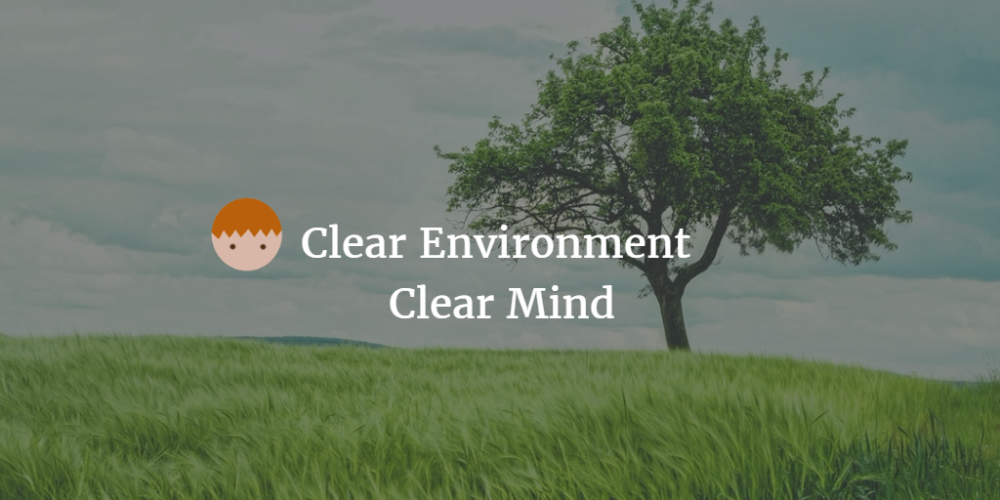
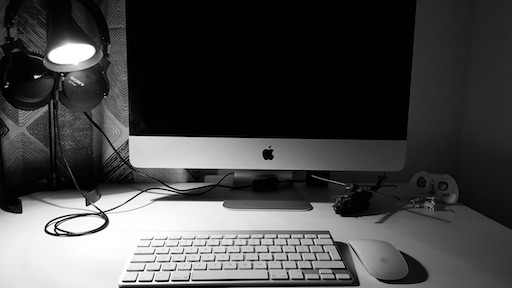

--- 
layout: post 
title:  Clear Environment, Clear Mind
author: Lewis Gavin 
comments: true 
tags: 
- self improvement
- productivity
---

[Last week I talked about Disconnecting](http://www.lewisgavin.co.uk/Disconnect/), how I've achieved it and why I've started to do it. This week I wanted to concentrate on improvements I have made to my non digital environments. 

If you're wondering when I will be posting the next technical blog post, then fear not. I'm currently working through [Udacity's Deep Learning course](https://www.udacity.com/course/deep-learning--ud730) and will be writing a related series.

## The Motivation

I've always been a person who thrives on order. Everything should have its own place and function. Yet my brain tends to get full and cluttered. Even more so in high anxiety environments. This has definitely helped when playing sports, doing school work and now at work. This is because I always strive to do more in case it wasn't enough. I also tend to pick up things quicker as I'd be able to cram everything in.

The only downside is that I've always struggled relaxing and switching off. A problem arises and I tend to jump straight into solution mode. As a software developer this can be a blessing and a curse. In the early days it meant that I was very productive and could solve simple problems.

As I've progressed though I've found that the problems become more complex. These problems, although I would still try, need more thought. I'd noticed this and was **trying to find a way to slow my racing mind down**. I wanted to work through a problem with patience and more upfront thought. Then, and only then, begin implementing a solution.

## How I've looked to solve the problem

First of all, by not rushing to a conclusion. I spent a lot of time assessing the options and finding the root cause. Now I understand this behaviour is a part of my nature. The next step is to find tools and techniques to overcome it where I felt necessary.

As stated in the last post, the focus is **Reduction**. I've found the most effective solutions tend to subtract rather than add. In my role as a software engineer, removing code is often preferred to adding code. So why can't this be the same with problems in every day life?

I thought I'd give it a go. As you saw in the [last post](http://www.lewisgavin.co.uk/Disconnect/), I started with my mobile phone. Removing all the clutter and distractions that come with a smart phone. The next step was to apply this same solution to environments in my every day life. This includes rooms at home, my wardrobe, drawers and my work desk.

I took a long hard look at every item of clothing in my wardrobe and asked "How many times in the last 3 months did you wear this item of clothing?".
So many times the answer was 0 and so I removed a lot of my old clothing items, in general T-Shirts.

I applied this same logic to my home office desk. I removed all unnecessary items until only my iMac, the lamp and 2 decorative items remained. I decided to keep decorative items to a minimum and they must serve a purpose. The first item is my Eurocopter helicopter model: this reminds me of my year spent in Germany and it's impact on my life. The second: my mini drone that provides an escape when I need time to concentrate on anything else.

I did the same to my work desk too. I used to want all the monitors and all the computers I could get my hands on. It was great and I felt productive. I had the ability to spread my work out across monitors and switch between work environments. Looking back though, it made my desk very cluttered. I often found it difficult to concentrate on one thing at a time. I've now reduced this to a single laptop with a vertical external screen for code. I removed all the clutter. Again, the only decorative items serve a purpose, reminding me of achievements or memories.

## What has been the outcome?

Since doing this, I've found that I can concentrate a lot easier. I've got less phone distractions and now I also have less visual distractions. Less items to distract my attention, less monitors and thus less anxiety. My environment now allows me to think clearly and return to order whenever things get busy.

As I mentioned earlier, it satisfies that part of my brain that requires order. Now this all could be a bunch of bullshit. Yet at the end of the day I now have tidier spaces which can never be a bad thing and I am more relaxed because of it. For that reason alone it has to be worth a try!
