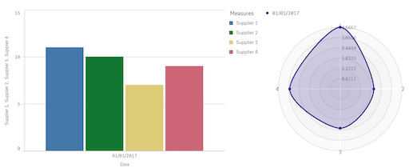

--- 
layout: post 
title:  Drag and Drop Visualisations with QlikSense
author: Lewis Gavin 
comments: true 
tags: 
- data science
- big data
- qlik
---

Recently I downloaded QlikSense. The plan was to play around with the tool and see how it worked. I started off with a very simple problem. Could I load some data into a MySQL database, in a relational schema, and use QlikSense to produce some quick visualisations.

## Setup

The first thing to do was setup an ODBC connector to my MySQL instance using the *Setup an ODBC connection* on windows. Once complete you can then go into QlikSense and use the Add Data menu. From here I used the *Connect my Data* tab and selected the ODBC connector. From the System DSN menu you should be able to see the ODBC connection you just set up.

The next step is to select the tables you are interested in using within QlikSense and select *Prepare Data*. When preparing the data we could simply map out the relationships across each of the tables (how they are joined). QlikSense has a magic wand button that tries to derive the model for you (from the MySQL metadata I'm guessing) however this didn't find the relationships as I expected, so I manually configured the relationships between tables.

## Creating my first Visualisation

Once all the relationship are configured you are presented with a **Sheet**. A sheet allows you to construct a dashboard and start plugging in visualisations. I started out with a really simple bar graph. I just wanted to plot a single dimension against a single measure just to prove the concept. 

To achieve this you just had to drag a bar chart in from the left hand menu. This gives you the option to supply a dimension and a measure. From my database tables I selected **Month** as my dimension and **Sum(Sales)** as my measure. I only had a single months worth of test data in my database, which produced the following.

Not earth shattering, however within a few minutes I was already up and running.

## Using some Advanced Features

Now I wanted to try and find something more advanced to play with. I wanted to plot multiple measures against the two dimensions: Time and Supplier. This wasn't as simple to get my head around and the solution I produced may or may not be the correct solution, however it works a treat. 

To achieve this I used the same chart with the same *single* dimension of Time. Now immediately this doesn't sound intuitive considering I wanted to plot over two dimensions, so stick with me.

I then added multiple measures, all of them doing a Sum of the sales however this is where it turned interesting. I used the formula feature that allows you within the **Expression** box for the Measure to insert your own statements using the QlikSense expression syntax. 

~~~
Sum( {$<[supplier_fk-supplier_pk] = {1}>} sales)
~~~

This expression is still performing a sum of the sales, but only where the supplier key is equal to 1. You then add multiple of these Measures are change the filter for the sum. Very quickly you now have a more advanced visualisation showing the sum of sales per supplier, per month.

## Using Extensions

The next step was to try and bring in some more advanced visualisations by trying to use extensions. There is a whole catalog on [QlikBranch](http://branch.qlik.com/#!/project), which is their own GitHub style platform for sharing content between developers. You can download any of the extensiosn that are available and you save them to a specific area on your machine. On windows this was: `C:\Users\<Your username>\Documents\Qlik\Sense\Extensions`.

These visualisations will then become available in the **extensions** tab on the left hand side. They work in a similar way to the built-in visualisations, in that you can just drag and drop and immediately begin editing. The one I wanted to test out was the radar. I quite like this as an example because it's quite similar to when you're comparing football players on FIFA, and you want to see how to play stack up against each other across a bunch of different attributes.  

Once installed, I dragged it next to my original graph and started playing. It immediately presents you with the option for 2 dimensions and a single measure. I selected Date and then Supplier ID as my two dimensions, and the Avg(Sales) as my measure. Now my dashboard will show the me not only the sum of sales for the month per supplier, but also the sales average.

## Wrap up

After a couple of hours of playing, I managed to create something that could be used to draw insights out of some fairly simple datasets. However I could start displaying them using quite advanced techniques. Something that is ever important when racing to market against competitors all trying to rapidly prototype visualisations to demonstrate their analytics capability.
