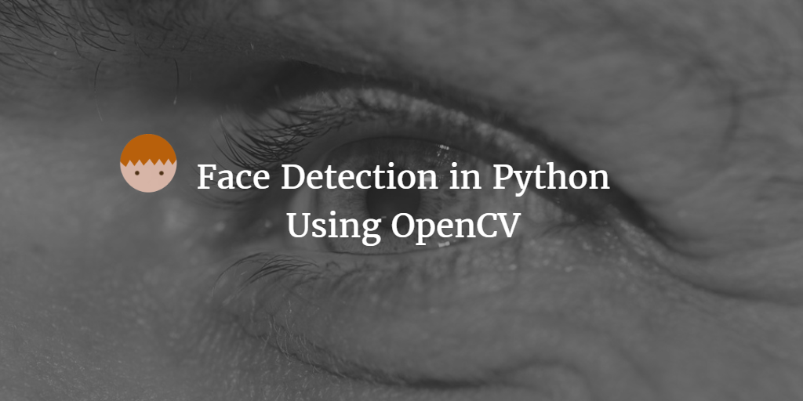
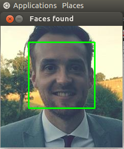

--- 
layout: post 
title:  Face Detection using OpenCV in Python
author: Lewis Gavin 
comments: true 
tags: 
- data science
- deep learning
- python
---

I've recently been on a journey to learn more about Deep Learning. I started off with an *Intro to Deep Learning* course on Udacity. If, like me, you are just starting out with Data Science techniques and don't have a heavy mathematical background, I would avoid this course until you have a little more experience.

With this in mind, I wanted to start off lighter and simpler. I wanted a way to introduce myself to Deep Learning but in a fun way. To do this I decided on the "Hello World" of Deep Learning: Image Recognition. I wanted to see if I could build an application that could recognise my face. Here's how I approached it using **Python** and a bunch of really cool libraries.

In part 1 I will be doing simple face detection and moving onto the more complicated aspects in further posts.

## 1. Install OpenCV

As with most tutorials, a good starting point is to ensure you've got your environment set up. This was one of the most time consuming things. To prevent you getting bored with setup after setup without seeing anything tangible, there is something fun to do after this install.

Download and install [OpenCV](http://opencv.org/) for your OS of choice (and of course ensure you have Python installed too). Theres a version 2.x and 3.x. I installed version 3.x.

No we can go ahead and follow a simple example from the OpenCV website to try and detect faces within your own supplied images.

## 2. Detecting your own face in an image

Create yourself a fresh directory and within it, place an image of yourself or a celebrity. There can be more than one person in the photo, but for this example I just used a simple photo of myself.

We also need to copy in our Haar Cascades metadata file for detecting faces. The OpenCV download folder from the previous step contains a bunch of these for detecting different things such as eyes, ears etc. We want to detect the whole face so we will be using the `haarcascade_frontalface_default.xml`. I found this within the following folder: 

`<open cv install dir>/opencv/opencv-3.2.0/data/haarcascades/`

Now we have our test image and our Haar Cascade file, we need to write a python application to detect the face. It's a relatively simple application that looks as follows - again the core of this code was taken from the OpenCV website:

~~~python
import cv2
import sys

# get paths for the image and haar cascade
imagePath = sys.argv[1]
cascPath = sys.argv[2]

# Create the haar cascade
faceCascade = cv2.CascadeClassifier(cascPath)

# Read the image and convert to gray
image = cv2.imread(imagePath)
gray = cv2.cvtColor(image, cv2.COLOR_BGR2GRAY)

# now we can try to detect faces
faces = faceCascade.detectMultiScale(
    gray,
    scaleFactor=1.1,
    minNeighbors=5,
    minSize=(30, 30),
    flags = cv2.CASCADE_SCALE_IMAGE
)

# Draw a rectangle around the faces and display on screen
for (x, y, w, h) in faces:
    cv2.rectangle(image, (x, y), (x+w, y+h), (0, 255, 0), 2)

cv2.imshow("Faces found", image)
cv2.waitKey(0)
cv2.destroyAllWindows()

~~~

I saved this in a file named `facerec.py`. Run it with the following command to pass in firstly your test image, and then the Cascade file. **Note: If you are using OpenCV version 2.x then you might need to replace `flags=cv2.CASCADE_SCALE_IMAGE` with `flags=cv2.cv.CV_HAAR_SCALE_IMAGE`.**

~~~bash
python facerec.py me.jpg haarcascade_frontalface_default.xml
~~~

I got the following output:

## Wrap up

As you can see, in very few lines of code, you can build an image detection application that is generic enough to detect a whole range of things. The only modification is the xml metadata file supplied at runtime. 

In the next posts I will be looking at facial feature alignment so that even pictures with faces at an angle can be aligned to have the core features: eyes, noes and mouth nicely centered. I will then be looking at using this output to train a Deep Learning Model