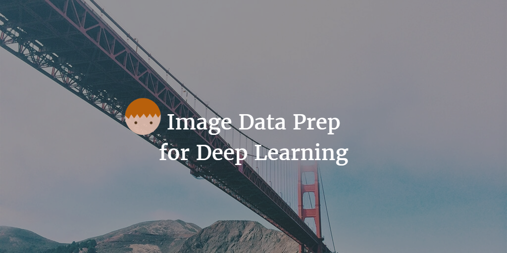
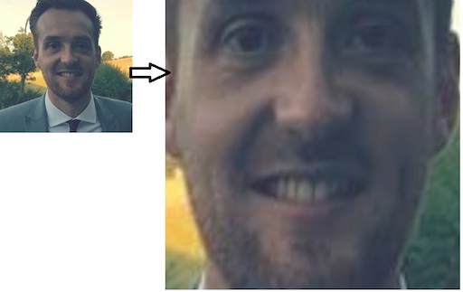

--- 
layout: post 
title:  Image Data Prep for Deep Learning Model
author: Lewis Gavin 
comments: true 
tags: 
- data science
- deep learning
- python
---

Following on from [last weeks post](http://www.lewisgavin.co.uk/FaceRecognition) on face detection. I wanted to figure out a way to skew images so that facial features were aligned regardless of the angle of the face. 

## Upfront thinking

I started by asking myself, what is it that I am trying to achieve? 

I have a face and regardless of which direction it is facing, I want to align it so it is facing forward and is at the centre of the image. So how do I first of all detect which way the face is looking and where it is? For this I could use the location of the eyes, nose and mouth and use them as a guideline.

After a bit of searching I found out that this technique of finding facial features is called **facial landmark detection**. So now I have a starting point. Find the coordinates on the image of a bunch of facial landmarks.

I can then use these to skew the image so these points are transformed and appear aligned so they are in the centre of the image. 

## How did I do it?

I spent quite a long time looking to enhance the code I had from last weeks blog post. The idea was to use opencv to find the coordinates for each of the facial landmarks. Once I'd done that it was then figuring out how to do the transformation of these points to the centre regardless of their starting point.

This sounds well on paper, but in practice trying to find the haarcascade metadata files for each of these coordinates, running it against the image, extracting each set of coordinates and then feeding them individually into a transformation function just seemed like a whole lot of effort. I spent some time playing with this then I decided to look around to see if there was a better solution.

**Turns out I was looking for dlib**. Dlib is a library that basically has facial landmark recognition built in and works perfectly with another python library called **openface** that helps you transform and skew an image.

I found this wonderful example below on a great blog series named [Machine Learning is Fun!](https://medium.com/@ageitgey/machine-learning-is-fun-part-4-modern-face-recognition-with-deep-learning-c3cffc121d78#.di1l1wgpv)

~~~python
import sys
import dlib
import cv2
import openface

# You can download the required pre-trained face detection model here:
# http://dlib.net/files/shape_predictor_68_face_landmarks.dat.bz2
predictor_model = "shape_predictor_68_face_landmarks.dat"

# Take the image file name from the command line
file_name = sys.argv[1]

# Create a HOG face detector using the built-in dlib class
face_detector = dlib.get_frontal_face_detector()
face_pose_predictor = dlib.shape_predictor(predictor_model)
face_aligner = openface.AlignDlib(predictor_model)

# Take the image file name from the command line
file_name = sys.argv[1]

# Load the image
image = cv2.imread(file_name)

# Run the HOG face detector on the image data
detected_faces = face_detector(image, 1)

print("Found {} faces in the image file {}".format(len(detected_faces), file_name))

# Loop through each face we found in the image
for i, face_rect in enumerate(detected_faces):

        # Detected faces are returned as an object with the coordinates
        # of the top, left, right and bottom edges
        print("- Face #{} found at Left: {} Top: {} Right: {} Bottom: {}".format(i, face_rect.left(), face_rect.top(), face_rect.right(), face_rect.bottom()))

        # Get the the face's pose
        pose_landmarks = face_pose_predictor(image, face_rect)

        # Use openface to calculate and perform the face alignment
        alignedFace = face_aligner.align(534, image, face_rect, landmarkIndices=openface.AlignDlib.OUTER_EYES_AND_NOSE)

        # Save the aligned image to a file
        cv2.imwrite("aligned_face_{}.jpg".format(i), alignedFace)

~~~

When running the above with my face image it gets skewed and transformed so all my facial features are aligned. As you can see below, it not only aligns the features but increases the size of the face too. I can then do this with multiple facial images so the features are always in the same place.

My data should then be ready to use in a Deep Learning model. Now all the features are aligned this should improve the accuracy of the model as position of features shouldn't affect how it predicts who's face it is!

**Join me next week where I hope to run this against multiple images of both myself and other celebrities and try to build a deep learning model to be able to recognise who is in each image!**

