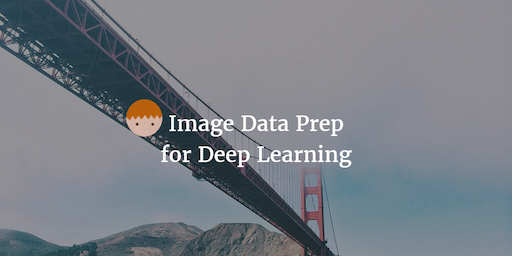

--- 
layout: post 
title:  Image Data Prep for Deep Learning Model
author: Lewis Gavin 
comments: true 
tags: 
- data science
- deep learning
- python
---

Following on from last weeks post on face detection. I wanted to figure out a way to skew images so that facial features were aligned regardless of the angle of the face. 

## Upfront thinking

I started by asking myself, what is it that I am trying to achieve? 

I have a face and regardless of which direction it is facing, I want to align it so it is facing forward and is at the centre of the image. So how do I first of all detect which way the face is looking and where it is? For this I could use the location of the eyes, nose and mouth and use them as a guideline.

After a bit of searching I found out that this technique of finding facial features is called **facial landmark detection**. So now I have a starting point. Find the coordinates on the image of a bunch of facial landmarks.

I can then use these to skew the image so these points are transformed and appear aligned so they are in the centre of the image. 

## How did I do it?

I spent quite a long time looking to enhance the code I had from last weeks blog post. The idea was to use opencv to find the coordinates for each of the facial landmarks. Once I'd done that it was then figuring out how to do the transformation of these points to the centre regardless of their starting point.

This sounds well on paper, but in practice trying to find the haarcascade metadata files for each of these coordinates, running it against the image, extracting each set of coordinates and then feeding them individually into a transformation function just seemed like a whole lot of effort. I spent some time playing with this then I decided to look around to see if there was a better solution.

**Turns out I was looking for dlib**. Dlib is a library that basically has facial landmark recognition built in and works perfectly with another python library called openface that helps you transform and skew an image.
