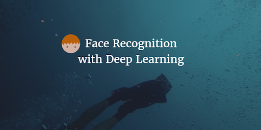
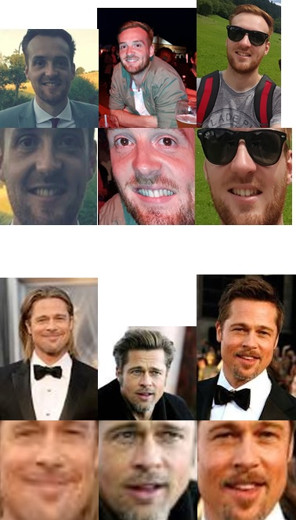

--- 
layout: post 
title:  Face Recognition with Deep Learning
author: Lewis Gavin 
comments: true 
tags: 
- data science
- deep learning
- python
---

In my previous two posts I looked at [Detecting faces within images](http://www.lewisgavin.co.uk/FaceRecognition) and then [Data prep](http://www.lewisgavin.co.uk/ImageDataPrep) to extract the face from the image and align it so that regardless of the rotation of the face, the facial features were always aligned centrally.

In this post I will be preparing a number of images of myself and also Brad Pitt. The goal will be to train a Deep Learning model on these images to see if it can detect the difference between us when presented with a new image.

It's sort of a Catch-22. If all goes well the model will be able to recognise me or Brad Pitt successfully. On the other hand, if it can do this easily, it probably means I look nothing like Brad Pitt!

## Deep Learning - What is it?

Machine Learning and Deep Learning are quite overloaded terms. They are seen as the silver bullet that can solve any problem, easily, without much effort. However it isn't always so simple. In order to build a model you need to understand what it is you are exactly looking for, what parameters are available, how much training data is available, how reliable is it etc.

Deep Learning is a strand of Machine Learning that concentrates on Neural Networks. That is programming and building a model that is inspired by the human brain. [Adam Geitgey has a great post](https://medium.com/@ageitgey/machine-learning-is-fun-part-2-a26a10b68df3#.7nppi8lvx) that will explain Neural Networks a lot better than I ever could.

For this post, Deep Learning will be used to produce points called embeddings (explained later). These points describe the image of the face. It's goal in our case, given images for two sets of people, is to ensure the points (embeddings) it produces are very similar for faces of the same person but very different than the faces of the other person.

1. Make sure all points produced for images of Brad Pitt's face are similar.
2. Make sure all points produced for images of my face are similar.
3. Make sure points produced for images of Brad Pitt are as different as possible to points produced for images of my face.

This will then allow us to train a [classification model](http://www.lewisgavin.co.uk/Machine-Learning-Basics/) to tell the two sets of images apart.

## Building some Training Data

The first step was to get some more data. I didn't want to spend forever digging and downloading images so I initially trialled it with 3 images of Brad and 3 images of myself, just to prove the concept.

I run each of the images through the `face_skew.py` python application I wrote in the [previous post](http://www.lewisgavin.co.uk/ImageDataPrep). This gave me a total of 6 aligned images. 

I stored these images in a folder called aligned_faces each within their own sub directory.

`./aligned_faces/me/`
`./aligned_faces/bradp/`

## Building Embeddings

Now I had prepped my data, it was time to build the embeddings. 

Remember that these embeddings are a set of 128 points that are produced by the Neural Network. These points are similar for the same faces and different from the faces of others. The 128 point embeddings process was developed out of some research at [Google](http://www.cv-foundation.org/openaccess/content_cvpr_2015/app/1A_089.pdf). Building a Deep Learning model to do this is time consuming and requires some beefy graphics cards. To overcome this, I have used a pre-trained model from [Openface](https://github.com/cmusatyalab/openface).

They provide some helper code along with the model that helped me generate my embeddings. You will need to make sure you have Python installed with the sklearn and pandas libraries, along with [Dlib](https://pypi.python.org/pypi/dlib#downloads), [OpenCV](http://docs.opencv.org/3.2.0/da/df6/tutorial_py_table_of_contents_setup.html) and Openface(https://github.com/cmusatyalab/openface) installed too. 

Once you have all that installed, go into the Openface base directory, then into a folder called `batch-recognise`.

From here I run the following commands to build the embeddings for my aligned faces.

~~~bash
./main.lua -outDir ~/facerecognition/embeddings/ -data ~/facerecognition/aligned_faces/
~~~

In the `outDir` this should produce 2 files: `labels.csv` and `reps.csv`. These contain the image paths for the input images and a row of 128 points for each image respectively.

**Success! I have run my images against a Deep Learning model and produced some output**

You may notice a trend when dealing with [Machine Learning applications](http://www.lewisgavin.co.uk/tag/machine%20learning/). Most of the work is in the data prep and getting the data into a format the is machine readable. In our case here, it was taking image data and converting it to a numerical representation. Before classifying textual data for sentiment analytics we have to do the same thing.

Once completed, all that remained was building a simple classifier to do the "recognition".

## Recognising Faces - Do I look like Brad Pitt?

If you want a more advanced approach to this step, you could train your own classification model to classify the embeddings. However within the Openface directory, they kindly provided an example python classifier that uses a [Support Vector Machine algorithm](http://www.lewisgavin.co.uk/Machine-Learning-SVM/).

From the Openface base directory, go into the directory named `demos`.

To train the classifier I ran the following:

~~~bash
$ python classifier.py train ~/facerecognition/embeddings
~~~

Now within your embeddings file, you should have a pickle file that contains your generated SVM.

To test it, I simply obtained two extra images that were different to the ones I used to train the model. One of myself and the other of Brad Pitt.

I ran them through and obtained the following results:

~~~bash
$ python classifier.py infer ~/facerecognition/embeddings/classifier.pkl /media/sf_Shared/test_image_me.jpg

=== /media/sf_Shared/test_image_me.jpg ===
Predict me with 0.86 confidence.

$ python classifier.py infer ~/facerecognition/embeddings/classifier.pkl /media/sf_Shared/test_image_bradp.jpeg

=== /media/sf_Shared/test_image_bradp.jpeg ===
Predict bradp with 0.73 confidence.

~~~

## Wrap Up

In conclusion, unfortunately, even with a training data set of just 3 images, **the model was able to easily tell me and Brad Pitt apart!** I should have seen it coming really.

It did however seem to work with just that small sample of data. This was a great intro to get me started with understanding the power of deep learning and how it works. It's important to read around on the subject as well as just copying a pasting the commands though, to at least gain some understanding of how the model worked. 

In the future I'll be looking at trying to build my own Deep Learning model from scratch.