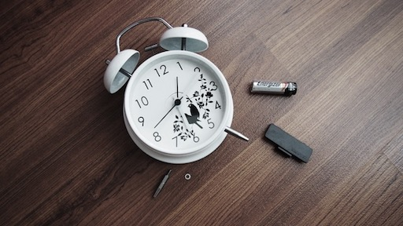

--- 
layout: post 
title:  Ideas for a Morning Routine to encourage Success
author: Lewis Gavin 
comments: true 
tags: 
- self improvement
- productivity
---

As promised, in 2017 I've already started writing more posts about self improvement and productivity. I've laid down the [foundation for my 2017 goals](http://www.lewisgavin.co.uk/Goals-2017/) and discussed some [tips and the benefits of disconnecting digitally](http://www.lewisgavin.co.uk/Disconnect/). The next logical step was to talk about [improvements to my every day environments](http://www.lewisgavin.co.uk/Clear-Mind/).

In the upcoming self-improvement posts, I'm going to talk about how I've crafted my morning routine. Starting with my road to becoming a morning person, followed by diet and behavioral changes during my working and non working days. Finally I'll share my techniques for unwinding on an evening in order to repair after a days work.

Let's kick it all off with the **Morning Routine**

## How it all started

When I started my most recent job in 2014, it involved a commute of around 45-60 minutes each way by car. In order to get something out of this time, I decided to start listening to podcasts. One of the initial podcasts was the [Tim Ferris Show](http://tim.blog/podcast/). For those of you that don't know, Tim interviews world class performers in order to share their techniques that contribute to their success. 

**One of the immediate commonalities was that a high number of these top end performers had strict morning routines.**

This lead me to start researching and looking into morning routines, reading blogs and getting my head around these morning people. I was far from a morning person after being at University studying computer science. This naturally leads you towards staying up late and getting up even later!

## The Morning Routine

With everything, this took time to build, I didn't just start doing all of this out of the box. I had to take time to build the habits up that allowed me to do this in a daily basis. 

**The good thing with habits is that they can easily strung together.** Nail one habit, and once mastered just attach another task after it and then boom you have two. This lead to the success of my morning routine.

### 1. No Snoozing! (< 1 Min)

This is probably one of the most difficult habits to break, but is by far the most important. Set an alarm, when it goes off, get out of bed. Sounds simple, but we all know it isn't!

**Tips for Success**
- Move your alarm away from your bed so you have to physically get up to turn it off
- Get a [Wake up light](https://www.amazon.co.uk/gp/product/B002TEXEAI/ref=as_li_qf_sp_asin_il_tl?ie=UTF8&camp=1634&creative=6738&creativeASIN=B002TEXEAI&linkCode=as2&tag=lewgav-21) alarm clock. This will slowly increase the light in the room before the alarm goes off to naturally wake you up. You'll feel more refreshed and therefore less likely to snooze
- Get a [puzzle alarm clock app](https://play.google.com/store/apps/details?id=com...puzzlealarmclock&hl=en_GB) to force you to work your brain to switch the alarm off.
- Countdown from 3 in your head and **3, 2, 1, OUT OF BED**

For me I tried all of these and still use the wake up light and countdown technique. It's important to break the habit of snoozing or looking at your phone first thing. It's wasted time and will not energize you. 

### 2. Energize Yourself (7 Mins)

You might need to take a quick leak first - I'm no animal! But once you've mastered the straight out of bed habit, you want to combine that with another habit: some morning exercise.

We all lead super busy lives and don't have enough time for exercise, I know, I get it, this was me too. However you can't tell me you don't have **just 7 minutes** to do some exercise. I read a blog post telling me the same thing and guess what, I couldn't find an excuse either!

Now I get up each morning and do a 7 minute workout. This gets the heart going, the blood flowing and removes that groggy morning feeling. I feel awake and energised and ready to attack the day!

**Tips for Success**
- I downloaded an [app called Seven - 7 Minute Workout (android)](https://play.google.com/store/apps/details?id=se.perigee.android.seven&hl=en_GB). It's designed to give you routines for all different areas of your body. The exercises are really straight forward, it has great visualisations to help with technique and **no exercise requires any kit**. Just you and your body.
- Mix up the routines each day. I do an abs routine one day, full body on another, maybe an arm workout. This changes things up so they don't become stale.
- [Get a Kettlebell](https://www.amazon.co.uk/gp/product/B000RGPAHA/ref=as_li_qf_sp_asin_il_tl?ie=UTF8&camp=1634&creative=6738&creativeASIN=B000RGPAHA&linkCode=as2&tag=lewgav-21) for some more advanced training. 

I now mix up my morning workout. Each day I perform a different routine switching between the Seven app and 7 minute kettle bell routines. Not only do I feel more awake, but I can see a noticeable difference in my physique.

### 3. Hydrate (1 Min + Shower 5-10 Mins)

This next habit you basically get for free. What else do you want more than a drink after doing a workout. That's why throwing this in here is dead simple. Go grab yourself a large glass of water before hitting the shower post workout.

**Tips for Success**
- Don't skip your workout, aha! But seriously, doing your workout will just make this happen
- Fill up a bottle before going to bed and leave it in the room where you will workout.

Super simple. You're now out of bed with no hesitation, energized and hydrated. 

*For a bonus energizer, go for a cold shower. Again you can build into this slowly. Either start by getting in to cold water for 10 seconds and then hitting the heat or ending your shower with a blast of cold water. Each day just try and increase the time spent in the cold*

### 4. Breakfast (10-15 Mins)

You can spend forever reading articles on super healthy breakfasts and what you should and shouldn't eat. Unfortunately **most of the alternative breakfasts out there can take a lot longer to make or become expensive if eaten regularly.**

For me, the simple solution was Porridge Oats. My go to option is 35 grams of porridge oats, 80 grams of fruit: blueberries, raspberries, strawberries, banana (either fresh or frozen works well) and milk or coconut water. This breakfast is quick and easy to make, relatively cheap and includes 1 portion of your 5-a-day fruit and veg. Not forgetting that it tastes great too.

**Tips for Success**
- Buying "smoothie mix" bags of frozen fruit can give you a nice mix of fruits
- You can also [spice this up a bit](http://www.jamieoliver.com/recipes/breakfast-recipes/chocolate-porridge/) if you wanted something extra special. This recipe requires some upfront work but can make a week or two's amount of breakfast. I go for this if I know I'll have some free time on a Sunday evening to prepare for the coming week.
- Microwave to save time

### 5. Commute (Some Mins)

This is the section that will be different for us all. If like me, you have a long commute, then use this time wisely. As I said earlier, I drive for around 45-60 mins each way. That's a long time spent traveling. To make the most of this time I listen to Podcasts or Audiobooks. 

Recommended Podcasts:
- [RadioLab](http://www.radiolab.org/series/podcasts/) - Interesting stories of Science, History and everything in our world.
- [Joe Rogan Experience](http://podcasts.joerogan.net/) - Comedian Joe Rogan has a vast array of guests on this podcast. Scientists, writers, hunters, MMA fighters, Comedians - the lot!
- [Tim Ferris Show](http://tim.blog/podcast/) - As mentioned earlier, Tim interviews successful people from many different fields to understand what makes them who they are
- [Bill Burr Monday Morning Podcast](http://billburr.com/podcast-2/) - If you want to spend your commute laughing, then this is the Podcast for you. Comedian Bill Burr rants and cracks jokes about a bunch of stuff and it is truly hilarious.
- [Startalk Radio](https://www.startalkradio.net/) - Neil deGrasse Tyson hosts this great show exploring all things space and science. With great scientific and comedic guests.

### Morning Routine Recap

Over time, I slowly built up the above routine to improve my day. This is especially powerful for the working week to get you up and motivated before starting work. You also get this feeling of productivity, because you have ticked a bunch of things off your list for the day already.

- Not snoozed: TICK (YES THIS IS AN ACHIEVEMENT)
- Done a workout: TICK
- Hydrated: TICK
- Learned Something: TICK

There are some tips that apply to all of the above in order to make them more achievable.

**Morning Routine Tips**
- Leave your WiFi off until you get to work/complete your routine. This stems from an evening routine discussed later. But having no WiFi on and no notifications, you won't be tempted to check your phone and get distracted.
- Start small and build up, trying to do them all at once might prove too much and cause you to revert back. Nail the first habit and use it as the building block for attaching new habits.
- Try and do it at the same time every morning to enforce the routine.

## Wrap up

That concludes my tips for boosting your productivity with a solid morning routine. In the coming posts I'll be looking at how to build on this solid foundation to get the most out of your day and relax in the evening.

Let me know on Twitter or in the comments below some of your morning rituals.

