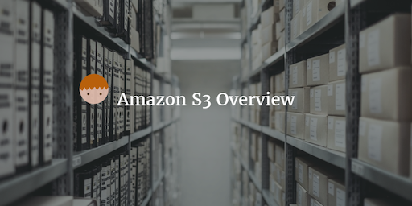
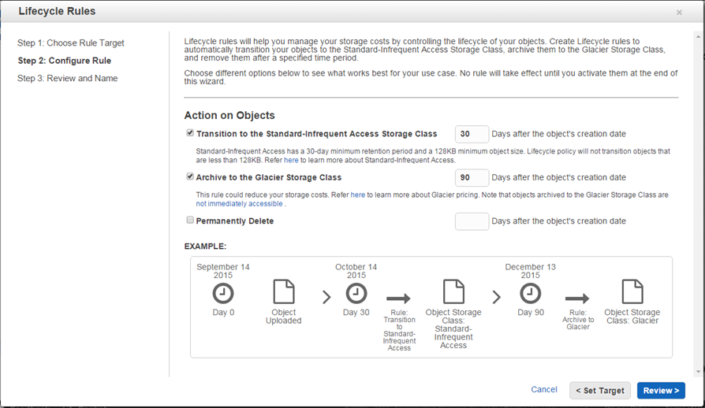

--- 
layout: post 
title:  AWS S3 Overview
author: Lewis Gavin 
comments: true 
tags: 
- cloud
- aws
---

This week I'm recapping what I've learned about data storage in AWS with a heavy focus on S3. If you want to see what else I've learned about AWS over the recent weeks then check out my [AWS Overview](http://www.lewisgavin.co.uk/AWSOverview), [EC2 Intro](http://www.lewisgavin.co.uk/AWS-EC2) and [Amazon Redshift at a Glance](http://www.lewisgavin.co.uk/Amazon-Redshift) posts.

## Amazon S3 101

S3 stands for Simple Storage Service. It is Amazon's object based storage service for uploading data files. It is not suitable for installing an OS for example. It's used for applications like Dropbox that allows users to store files of all different types in a Cloud based filesystem.

Files can be any size from 0 Bytes up to 5 Terabytes in size and the storage capacity is effectively unlimited. Amazon will continually increase their storage capacity at the back end. 

When a file is uploaded to S3, it will be stored in a **Bucket**. A Bucket is just like a folder or repository and will be the holding pen for all your sub folders and files. S3 is a universal namespace, meaning each S3 bucket you create must have a unique name that is not being used by anyone else in the world. This is because your bucket name makes up part of your S3 url, which must be unique.

Url Format: `https://s3-<region>.amazonaws.com/<bucketname>`
e.g.: `https://s3-eu-west-2.amazonaws.com/mybucketname`

## Reading and Writing Data to and from S3

When you upload a new file to S3, it has Read after Write consistency*. What this means is that once your file is successfully written to S3 it is immediately available for reading anywhere in the world.

However, if you are updating or deleting a file, S3 has *Eventual consistency*. This means that it can take some time for the update or delete to appear, so depending on the region you may or may not see the changes instantly. This is because if you're S3 file is cached on an edge location for example, then it may take time for the update or delete to propagate through to each of these locations.

Data stored in S3 can be held in one of 4 Storage Classes. 

1. Standard S3 - This is the most durable storage class and should be used for frequently accessed files that require quick access.
2. S3 Infrequently Accessed - As the name suggests, this is for files that are accessed less frequently but you still need available to you.
3. S3 Redundancy Storage - should be used for data that can be reproduced (no big issue if it is lost) such as thumbnails or auto generated docs.
4. Glacier - This is the data archive capability. You can hold your data here super cheaply, however can wait up to 3-5 hours for data access.

Files are stored with the following attributes:
- Key - the filename
- Value - the file data
- Version ID - if versioning is turned on, you can keep track of the current version. Versioning will store all versions of an object (even if you delete) so can be useful for backups and can be used in conjunction with MFA.
- Metadata - data about upload times, last accessed etc.

## Data Lifecycle Management

As your data ages within S3, you can set it up to flow through each of the Storage Classes in order to reduce your costs. So that data that is old and never accessed can be put into Glacier for example.

Lifecycle management can be applied to current or previous versions of files. You can move files into S3 IA after at least 30 days and then into Glacier another 30 days after being in IA. These numbers are all user configurable but can't be below the minimum of 30 days. Meaning at a minimum your file has to be within S3 + IA for 60 days before making its way to Glacier.

