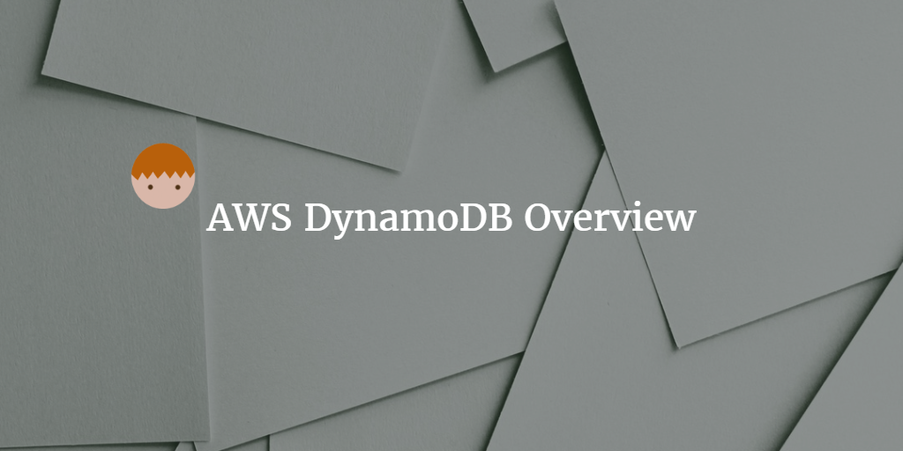
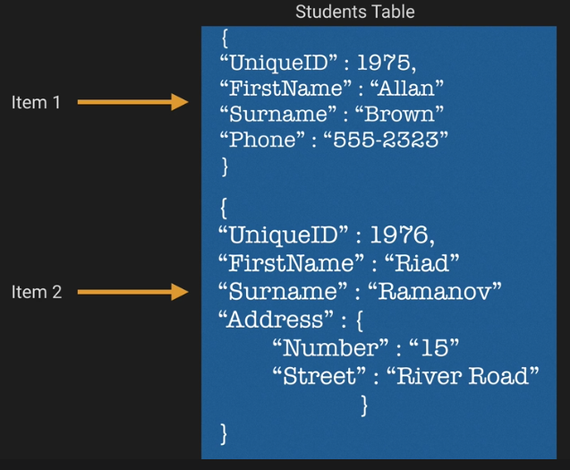

--- 
layout: post 
title:  AWS DynamoDB Overview
author: Lewis Gavin 
comments: true 
tags: 
- cloud
- aws
---

This week I'm recapping what I've learned about Amazon's NoSQL database offering, DynamoDB. If you want to see what else I've learned about AWS over the recent weeks then check out my [AWS Overview](http://www.lewisgavin.co.uk/AWSOverview), [EC2 Intro](http://www.lewisgavin.co.uk/AWS-EC2) and [Amazon Redshift at a Glance](http://www.lewisgavin.co.uk/Amazon-Redshift) and [Amazon S3](http://www.lewisgavin.co.uk/AWS-S3) posts.

## What is it?

A fast and flexible NoSQL database to be used for data that requires very low latency and very large scales. Like many other NoSQL databases, it supports document and key-value data storage. 

Data is stored on SSD storage (contributing to its high speeds) and is distributed across 3 geographically distinct data centres for redundancy.

It has support for both Eventual and Strongly Consistent reads. Eventual Consistency is the default and the data is usually propagated within a second. If you need Strongly consistent reads then you will obviously take a performance hit but you will always receive consistent results after a successful write.

## How does it work?

A DynamoDB database can be broken down into 3 abstractions:

- Tables: A collection of things that you want to store together
- Items: An item is just like a row in a normal database
- Attributes: A column or field in a normal database

[**Example borrowed from AWS Certified Developer Associate Course: ACloud Guru**](https://acloud.guru/learn/aws-certified-developer-associate)

A DynamoDB table must have a primary key. There are two possible types to choose from:

1. Partition Key - Single Attribute - this will just be a field in your data source that uniquely represents the row (e.g. an auto generated, unique product ID).
2. Partition Key & Sort Key - Composite Key - this will be a combo of two attributes that will uniquely identify the row, and how the data should naturally be sorted (e.g. Unique product ID and purchase date timestamp)

It's important that your DynamoDB partition key is unique and sparse. As this key is hashed internally and used to distribute that data for storage. This is a similar technique to [Redshift](http://www.lewisgavin.co.uk/Amazon-Redshift) and [HBase](http://www.lewisgavin.co.uk/HBase-Intro/) that prevents hotspotting of data.

If using a composite key, then two items can have the same Partition Key but the Sort Key must be unique. This will mean all items with the same Partition key will be stored together but sorted in ascending order using the Sort Key.

## Calculating Throughput Units

**To Calculate Read throughput:**
1. Round item size up to nearest 4kb increment
2. Divide size by 4kb
3. Multiply Answer by number of items to be read
4. IF eventual consistency then divide answer by 2 else take answer as is.

Q: Read 5 items at 10kb per second using eventual consistency.
A: 10kb rounded up to nearest 4kb increment = 12KB
12KB/4KB = 3 read units per item
3*5 read items = 15
Eventual consistency means we divide by 2 - 15/2 = 7.5
Round up to 8 Units of read throughput

Q: Read 5 items at 13kb per second using strong consistency.
A: 13kb rounded up to nearest 4kb increment = 16KB
16KB/4KB = 4 read units per item
4*5 read items = 20
Strong consistency so answer is 20 units of read throughput

**To Calculate Write throughput:**

Each write unit consists of 1kb. So multiply number of items by size in KB.

Q: Write 12 items of 100kb per second.
A: Each write unit consists of 1kb of data so
12 * 100KB = 1200 Write Units

