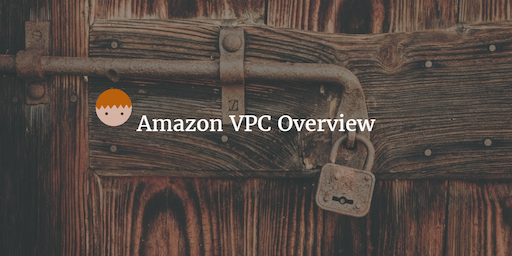

--- 
layout: post 
title:  AWS VPC Overview
author: Lewis Gavin 
comments: true 
tags: 
- cloud
- aws
---

This week I'm recapping what I've learned about Amazon's Virtual Private Cloud (VPC). If you want to see what else I've learned about AWS over the recent weeks then check out my [AWS Overview](http://www.lewisgavin.co.uk/AWSOverview), [EC2 Intro](http://www.lewisgavin.co.uk/AWS-EC2), [Amazon Redshift at a Glance](http://www.lewisgavin.co.uk/Amazon-Redshift), [Amazon S3](http://www.lewisgavin.co.uk/AWS-S3) and [AWS DynamoDB](http://www.lewisgavin.co.uk/AWS-DynamoDB) posts.

## What is it?

A VPC is a virtual network specific to you within AWS for you to hold all your AWS services. It is a logical data center in AWS and will have gateways, route tables, network access control lists (ACL), subnets and security groups.

Things to note:
- Each subnet exists within 1 availability zone. 
- Security groups are stateful, ACL's are stateless
- VPC's can be peered within the same account and across AWS accounts
- Transitive peering is not allowed, meaning you cant hop from one VPC to another, via another VPC. You must have direct access.

## Why use a VPC?

When you open up a service within a public cloud, it is effectively open to the world and can be at risk to attacks from the internet. In order to lock your instances down and secure them against attacks from the outside, you lock them within a VPC. The VPC restricts what sort of traffic can access your instances, the IP addresses and also the users that have access.

This prevents unwanted guests accessing your resources and secures you from things like DDOS attacks. Not all services require access to the internet, so those can be locked away safely within a private network. You can then expose only certain machines to the internet. 

Obviously, if you are wanted to install software or access the internet from private instances that are blocked off from the internet, then this is a problem. However there are a few solutions to this problem that I will cover next.

## NAT Instances

A NAT instance can be used to solve the problem discussed in the last section. How do I install things from the internet on my secured private instances. One solution is to use a NAT instance. 

A NAT instance is created in a public subnet with access to the internet. Once you allow access from your private instance to your NAT, your private instance will then be able to make requests to the internet. This access is one way i.e. someone from the internet cannot access your instance.

Things to note:
- A NAT instance must be in a public subnet
- It must have an Elastic IP
- There must be a route from your private subnet into the NAT instance
- You can manually create high availability using Autoscaling groups and multiple subnets
- Different to a Bastian because a NAT is used to provide internet access to private instances, a Bastian is used to administer instance using SSH for example.
- They are now sort of deprecated and replaced with NAT Gateways

*Image taken from [wrathofchris.wordpress.com](https://wrathofchris.wordpress.com/2014/04/14/crossing-the-amazon-vpc-boundary/)*

## NAT Gateways

NAT Gateways have basically replaced NAT instances as they allow the same thing, access to the internet from a private subnet with the same security. However they are much easier to set up and scale as this is all managed by Amazon.

Things to note:
- Scale automatically up to 10Gbps
- No need to manually patch - amazon takes care of this
- Not associate with security groups
- automatically assigned a public IP

## Network ACL's

By default, a VPC will come with a Network ACL and it will allow all inbound  and outbound traffic. However if you create a default Network ACL, it will **block** all inbound and outbound traffic, and you will have to manually allow traffic yourself.

Each subnet within a VPC must be connected to a Network ACL, however each subnet can only be connected to 1 VPC at a time but the ACL can be connected to multiple different subnets.

Things to remember:
- The Network ACL contains an ordered list of rules to allow traffic
- The convention is to start from 100 and go up in increments of 100.
- The rules will be considered in order so make sure if you want to allow all ssh access apart from a certain IP address, that you add your block rule before your allow all rule.
- There are separate rules for inbound and outbound traffic, so you must set up rules for each.
- They are stateless meaning responses to inbound traffic are dependent on outbound traffic rules and this applies the other way around.
- Block IP address using Network ACL's and not Security groups

## Resiliency

For resiliency it is advisable to always have 2 public and 2 private subnets and ensure they are both in different availability zones. The same applies to Elastic Load Balancers.

NAT Instances are a little more difficult to make highly available so its advised to use NAT Gateways instead, as all of this is taken care of and requires no manual effort.

You can always monitor traffic within your VPC by turning on VPC flow logs.